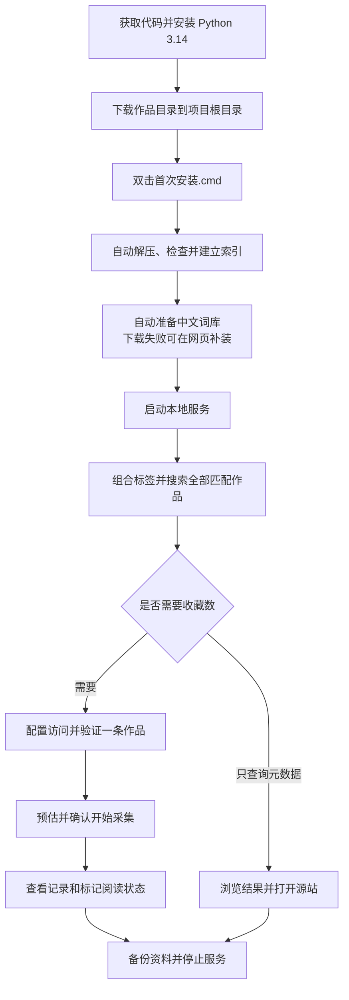

# 开发、源码运行与验证

本文面向开发者和需要运行源码的用户。桌面 exe 的下载与日常使用见 [README.md](README.md)，普通桌面用户无需安装 Python。

## 开发环境

- Windows x64，Python 3.14 与 Windows Python 启动器。
- 浏览器版只需 Python 标准库；桌面和构建依赖使用 `requirements-desktop.txt`。
- 桌面运行需 WebView2。源码与 exe 共用业务逻辑，资源与个人资料路径由 `runtime_paths.py` 管理。
- 修改和测试时使用临时资料库；维护现有资料前先通过应用内备份保存副本。

## 首次安装与启动

以下步骤用于源码浏览器版。普通桌面用户按 [README.md](README.md) 获取完整 exe 发布包即可。

### 1. 获取项目代码

在 GitHub 仓库页面选择 **Code → Download ZIP**，解压到一个固定文件夹；也可以使用 GitHub Desktop 克隆仓库。

后文的“项目根目录”指直接包含 `app.py`、`prepare_database.py` 和 `启动搜索.cmd` 的文件夹。不要在 ZIP 压缩包内直接运行脚本。

### 2. 安装 Python

从 [Python 官方下载页面](https://www.python.org/downloads/)安装 Python 3.14，并确保安装了 Windows Python 启动器，使 `py` 命令可用。

双击脚本会自动检查是否能启动 Python 3.14。未安装或启动器不可用时，窗口会显示安装提示；完成安装后重新双击即可。只安装其他 Python 版本或只有 `python` 命令时，这些脚本不能直接启动。

### 3. 下载作品目录

打开 [URenko/e-hentai-db 的 nightly 发布页](https://github.com/URenko/e-hentai-db/releases/tag/nightly)，下载 **`e-hentai.db.zstd`**，放到项目根目录。

使用 SQLite 格式的 `.zstd` 包，旧 MySQL 包不再更新。若浏览器保存为 `e-hentai.db (1).zstd` 等名称，请先整理为准确的 `e-hentai.db.zstd`。保留一份原始压缩包副本便于重新准备数据。

此时目录应类似：

```text
exhentai/
├─ app.py
├─ prepare_database.py
├─ initialize_catalog.py
├─ 首次安装.cmd
├─ 启动搜索.cmd
├─ static/
└─ e-hentai.db.zstd        # 自行下载，不在代码仓库中
```

### 4. 双击首次安装

双击项目根目录的 **`首次安装.cmd`**，保持窗口打开并等待。程序会依次：

1. 检查 Python 3.14 与本地压缩包。
2. 流式解压为 `data/catalog.sqlite3`，检查数据库结构。
3. 检查 SQLite 完整性、建立查询索引并生成目录概况。
4. 本地没有词库时下载官方中文词库。
5. 启动本地服务，在默认浏览器打开搜索页面。

**`启动搜索.cmd` 也具备相同的首次准备能力**，没有资料库时会自动准备，准备完成后的日常启动直接打开网页。已有作品目录、收藏资料和词库会保留，不会因为再次双击就重新覆盖。

大目录的解压、检查与索引需要等待，窗口会显示当前阶段。中断建索引后可以再次双击继续准备；中断解压留下 `.partial` 时，先按提示核对并另存未完成文件，再重新准备。避免同时开启多个准备窗口。

词库下载失败会显示提示并继续启动英文标签搜索。之后进入 **资料库维护 → 中文词库 → 安装中文词库**即可补装。后续更换作品目录使用[更新作品目录](README.md#更新作品目录)，不要重新执行底层解压来覆盖旧库。

### 5. 确认可用

默认浏览器会打开 [http://127.0.0.1:8765](http://127.0.0.1:8765)。

确认页面已连接本地服务、显示作品记录数与标签数，再输入 `language:chinese`，从建议中选中并点击 **搜索资料库**。能看到结果，就完成了首次准备。

首次准备完成后，日常使用只需双击启动脚本，无需重复解压和建索引。



## 构建桌面发布包

构建机需 Windows x64、Python 3.14 和 Windows Python 启动器。普通用户不需要这些开发工具。

```powershell
powershell -ExecutionPolicy Bypass -File build_desktop.ps1
```

脚本创建独立 `.venv-desktop`，安装固定版本依赖并输出：

- `dist/ExCatalog/ExCatalog.exe`：完整文件夹版中的启动程序。
- `dist/ExCatalog-Windows-x64.zip`：可分发的完整程序包。
- `dist/SHA256SUMS.txt`：压缩包的 SHA-256 校验值。
- `dist/RELEASE_NOTES.md`：可复制到 GitHub Releases 的中文更新说明。

构建前扫描将上传的源码；打包后扫描 ZIP、内置 ZIP 和 exe 中的解压 Python 模块，检查本机用户路径、明显密钥及个人资料文件。任何检查失败都不能上传。另可运行 `.venv-desktop\Scripts\python.exe -X utf8 verify_release.py --package dist/ExCatalog-Windows-x64.zip`。

构建不会收集 `data`、`logs`、`backups` 或作品压缩包。若发布输出目录已有用户资料，脚本会拒绝覆盖，请先另存资料。

源码桌面启动：

```powershell
.venv-desktop\Scripts\python.exe desktop.py
```

打包后的隔离验证（需要先完成构建）：

```powershell
py -3.14 -X utf8 tests/verify_packaged.py
```

该脚本使用临时测试资料，移除子进程 PATH 中的 Python，验证实际 exe 的 WebView2 页面、导出、备份与正常退出。直接运行 `ExCatalog.exe --verify-desktop "D:\检查结果.json"` 也可生成桌面隔离验证报告及页面截图。以上验证不使用真实账号和个人资料。

## 命令行用法

以下命令都在项目根目录执行。

### 常用命令

```powershell
# 自动完成首次准备并打开网页
py -3.14 launch.py

# 需要逐项处理时，手动准备作品目录
py -3.14 prepare_database.py
py -3.14 initialize_catalog.py

# 更新词库
py -3.14 update_translations.py

# 启动服务并打开浏览器
py -3.14 launch.py

# 启动服务但不打开浏览器
py -3.14 launch.py --no-browser

# 停止默认端口上的服务
py -3.14 launch.py --stop

# 在线轻量 / 完整备份
py -3.14 -X utf8 maintenance.py backup
py -3.14 -X utf8 maintenance.py backup --full

# 导入根目录中已经下载的新版压缩包
py -3.14 -X utf8 maintenance.py import
```

`initialize_catalog.py` 的命令行入口使用默认 `data/catalog.sqlite3`，没有自定义路径参数；维护页会为候选目录调用同一初始化逻辑。

### 前台运行与自定义端口

```powershell
# 在当前终端运行，便于查看启动错误
py -3.14 app.py

# 自定义端口示例
py -3.14 app.py --port 8766
```

自定义端口示例的页面地址为 [http://127.0.0.1:8766](http://127.0.0.1:8766)。`launch.py`、双击脚本和命令行维护工具固定使用 **8765**，不会自动连接自定义端口；使用自定义端口时，通过该端口的网页维护 / 停止服务，或在前台终端按 Ctrl+C 结束。

### 可选校验与路径参数

```powershell
# 使用其他位置的压缩包，仍解压到默认数据库
py -3.14 prepare_database.py --source "D:\Catalog\e-hentai.db.zstd"

# 将下面占位文字替换为可信来源提供的 64 位校验值
py -3.14 prepare_database.py --sha256 "压缩包的SHA-256值"
py -3.14 update_translations.py --sha256 "词库压缩包的SHA-256值"
```

上面两条 `--sha256` 命令是模板，执行前替换占位文字。也可用 PowerShell 检查本地文件：

```powershell
Get-FileHash .\e-hentai.db.zstd -Algorithm SHA256
```

校验需要与可信来源公布的值比较，只有自己计算出的值不能证明下载文件与来源一致。

`prepare_database.py` 另有 `--database`，`app.py` 也支持 `--database`，词库更新支持 `--url`；这些是高级入口。普通使用保持默认路径，便于启动脚本、索引初始化和维护功能协同工作；不要用底层解压命令替代已有目录的维护更新流程。

## 项目结构与数据文件

```text
exhentai/
├─ desktop.py                  # 内嵌窗口与打包后的辅助入口
├─ desktop_service.py          # 桌面服务启动与安全退出
├─ runtime_paths.py            # 程序资源与用户资料路径、服务互斥
├─ ExCatalog.spec              # Windows 文件夹版打包配置
├─ build_desktop.ps1           # 固定依赖、构建与生成发布包
├─ requirements-desktop.txt    # 桌面及构建依赖版本
├─ app.py                      # 本地 HTTP 服务、搜索、已记录与维护接口
├─ launch.py                   # 后台启动、打开页面、停止默认服务
├─ first_run.py                # 首次解压、建索引与词库准备
├─ prepare_database.py         # Zstandard 流式解压与表结构检查
├─ initialize_catalog.py       # SQLite 检查、索引与目录概况
├─ translations.py             # 译名解析、命名空间与标签建议
├─ update_translations.py      # 检查官方版本、校验并更新中文词库
├─ favorites.py                # 收藏数解析、缓存、队列、失败与阅读状态
├─ favorite_transfer.py        # 收藏数导出、版本兼容及按采集身份和增量合并
├─ collector_identity.py       # 采集者 ID、昵称校验与跨设备身份文件
├─ credentials.py              # Windows DPAPI 登录文件导入 / 导出
├─ covers.py                   # 公开封面代理与本地缓存
├─ maintenance.py              # 备份、恢复、新目录准备与切换
├─ static/                     # 搜索、记录、维护页面及样式和脚本
├─ tests/                      # Python 单元测试与浏览器回归脚本
├─ 首次安装.cmd
├─ 启动搜索.cmd
├─ 停止搜索.cmd
├─ 备份资料库.cmd
├─ 完整备份资料库.cmd
├─ 导入新版目录.cmd
├─ README.md
├─ THIRD_PARTY_NOTICES.md
├─ .gitignore
├─ e-hentai.db.zstd             # 自行下载；Git 忽略
├─ data/                       # 本地资料；Git 忽略
├─ logs/                       # 日志与运行信息；Git 忽略
└─ backups/                    # 默认备份位置；Git 忽略
```

| 文件 / 目录 | 用途 | 处理建议 |
| --- | --- | --- |
| `data/catalog.sqlite3` | 基础作品目录与本地查询索引 | 可重新导入；更新优先使用维护页 |
| `data/catalog_info.json` | 作品数、标签数、日期、初始化摘要 | 与当前目录配套保存 |
| **`data/favorites.sqlite3`** | 采集身份、收藏数及原采集者、失败、队列、阅读状态、点开次数与黑名单 | **个人资料核心文件，优先做好备份** |
| `data/tag-translations.json` | 中文词库 | 可单独更新，备份包含 |
| `data/tag-translations-info.json` | 词库来源、版本与校验摘要 | 随词库保存 |
| `data/tag-translations-check.json` | 最近一次官方版本检查结果 | 本机状态，不进入资料备份 |
| `data/tag-translations.previous.json` | 上一份词库 | 更新成功时生成，不在应用备份清单内 |
| `data/maintenance-settings.json` | 备份位置与自动备份配置 | 本机配置；网页恢复保留当前设置 |
| `data/covers/`、`data/covers.sqlite3` | 封面文件与缓存索引 | 可重新生成，不进入资料备份 |
| `data/.maintenance/` | 目录更新与备份恢复的暂存区 | 维护失败时先核对，不要在任务执行中清理 |
| `data/prepared-favorites-import.json` | 已校验收藏数文件的暂存信息 | 本机状态，不进入资料备份 |
| `logs/server.log` | 后台启动与运行诊断 | 启动失败时查看，不上传 |
| `logs/server-8765.json` | 本次默认服务的运行信息与本地操作令牌 | 程序管理，不上传或分享 |
| `backups/` 或自定义位置 | 带校验清单的独立备份 | 与源码分开保存，不上传个人备份 |
| `*.ehcred` | 加密登录文件 | 单独保管，换机时重新配置 |
| `*.ehfavorites.json` | 单独导出的收藏数文件 | 可用于合并迁移，Git 默认忽略 |
| `*.ehcollector.json` | 自己的采集身份与昵称 | 在自己的设备间迁移 ID，Git 默认忽略 |

不要在服务运行中直接复制单个 SQLite 主文件当作完整备份：已经提交的数据可能仍在 WAL 中。使用网页或备份脚本可以得到一致性副本。

## 开发与验证

浏览器版与 Python 单元测试使用标准库；桌面版额外依赖 pywebview / Python.NET，固定版本见 `requirements-desktop.txt`。修改源码后重新启动相应入口，桌面发布包需要重新构建。

运行 Python 单元测试：

```powershell
py -3.14 -m unittest discover -s tests -v
```

测试使用临时目录 / 数据库、模拟源站响应，覆盖查询、标签汉化、收藏数解析与缓存、预估确认、分批 / 分轮队列、失败记录、阅读状态、采集身份生成与迁移、原采集者转存、自己 / 他人 / 未知采集者的合并规则、旧版文件兼容、封面处理、加密登录文件、在线备份、目录更新回退、恢复与停止服务等行为，不需要真实账号或真实采集。真实源站访问需在本地页面通过 **验证并读取一条**单独确认。

`tests/visual_*.cjs` 与 `tests/visual_collector_server.py` 是浏览器回归辅助脚本，使用 Node.js / Playwright 等额外开发工具，不属于普通运行依赖，也不会随上述 `unittest` 命令执行。部分脚本包含本机测试环境路径，运行前需按自己的环境调整。

`tests/visual_favorites_share.cjs` 在 Git 忽略的 `logs/` 下创建独立模拟资料库并保留截图，验证折叠教程、导出文件对应的数量与原抓取时间范围、复制标题 / 正文、手动复制回退、取消 / 保存失败后清除旧信息、空文件、旧后台兼容及小窗口排版。收藏数 JSON 继续采用 version 2；分享摘要通过导出响应的 `X-Favorite-Share-Info` 传回浏览器或桌面保存桥接，不重新读取可能已变化的资料库。

## 发布新版客户端

遵循 `AGENTS.md` 的持续要求。每次用户功能更新：同步递增 `client_version.py` 的版本并填写中文更新内容，更新用户 README 与 `RELEASE_NOTES.md`，运行单元测试、构建脚本与隔离 exe 验证。

用户在 GitHub Desktop 中检查并提交源码后，在本仓库 Releases 创建对应的正式版本标签（本次为 `v1.1.6`），复制 `dist/RELEASE_NOTES.md` 的内容，上传 `dist/ExCatalog-Windows-x64.zip` 和 `dist/SHA256SUMS.txt`。GitHub 自动记录上传资产的 SHA-256 digest，应用更新器会读取并核对它。只上传上述公开发布文件，不要上传整个项目文件夹、日志、数据、备份或构建中间文件。发布完成后，通过客户端检查更新，核对版本号与资产名称。

客户端更新说明的已读版本保存在 `data/client-update-state.json`，属于本机配置，不写入发布包。安装器只替换允许清单内的程序文件，下载包含个人资料、路径穿越、重复成员、链接或校验不符时拒绝安装。

记录页显示方式保存在 `data/favorites.sqlite3` 的 `app_settings` 表的 `records_view` 配置项中；前端通过 `/api/preferences` 读取，通过受本机操作令牌保护的 `/api/records/view` 保存。旧网页缓存仅作为首次迁移来源，数据库设置优先，桌面 WebView2 继续使用临时浏览环境。打包验证会启动两个独立 exe 进程使用同一临时资料库，确认第二次启动恢复缩略图。

搜索结果复用 `static/gallery-cards.js` 的卡片和记录页样式；显示方式独立保存为 `search_view`，通过受本机操作令牌保护的 `/api/search/view` 更新。`tests/visual_search_views.cjs` 使用临时模拟资料库，验证四种视图、完整分组标签、零收藏与未知值、原采集者、源站切换、分页、标签筛选和新浏览器恢复独立设置，并在 `logs/` 保存大窗口和小窗口截图。`test_favorite_transfer.py` 覆盖旧目录缺失作品的分享导入、真实目录准备 / 切换 / 重载及重启后的自动 GID 匹配。

客户端启动更新检查由 `ClientUpdater` 的内存状态管理，每个桌面进程只启动一次后台查询；页面切换读取同一次结果。自动通知在本次运行中只领取一次，未读的本版本说明先显示。自动检查失败保持安静，手动检查仍可重试；启动检查不创建下载暂存区。`tests/visual_startup_updates.cjs` 使用模拟版本响应验证无新版、有新版、未读说明、离线及检查中切换页面的情况，打包隔离验证也使用模拟响应检查每个 exe 进程只请求一次。
