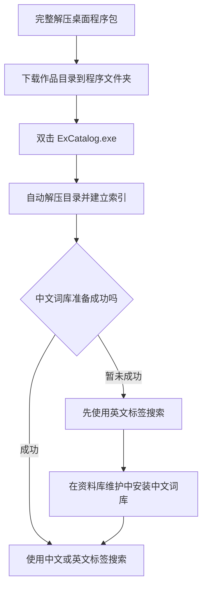
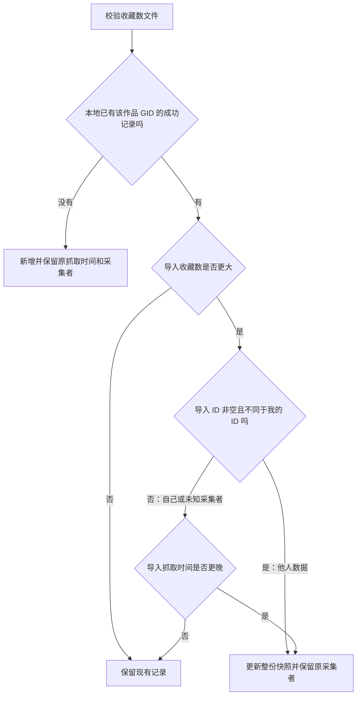

# EX资料库 · 本地标签搜索与收藏记录

一个在 Windows 本机运行的 E-Hentai / ExHentai 资料库工具。你可以组合中文或英文标签搜索作品、采集收藏数、管理阅读状态，并备份自己的记录。

**桌面版自带 Python 运行环境，无需安装 Python，也无需输入命令。** 完整解压程序包，放好作品目录数据，双击 `ExCatalog.exe` 即可。应用使用内嵌网页窗口，作品链接在默认浏览器中打开。

当前客户端版本：**v1.1.3**。

获取程序：[本项目发布页](https://github.com/IGreyeyes/exhentai-local-catalog/releases)。桌面发布包文件名为 `ExCatalog-Windows-x64.zip`。GitHub 的 **Code → Download ZIP** 下载的是源码包，供开发和构建使用。

## 功能概览

| 功能 | 可以做什么 |
| --- | --- |
| 标签与标题搜索 | 组合中文 / 英文标签、标题关键词与分类，按发布时间、评分、页数或收藏数排序 |
| 排除与黑名单 | 排除本次不想看的标签，或保存为长期黑名单 |
| 收藏数采集 | 按分轮、分批或全量模式采集，暂停后可继续，未知与零收藏分别显示 |
| 我的记录 | 四种显示方式、彩色分类，筛选成功 / 失败、标签、来源与时间 |
| 阅读状态 | 标记待看、在看、看过、不看，单独记录点开次数 |
| 收藏数导入导出 | 分享成功收藏数，预览后按规则合并，保留原抓取时间和原采集者 |
| 资料维护 | 备份和恢复个人资料，更新作品目录与中文词库 |
| 中文标签与封面 | 显示标签译名，缓存已经加载的封面 |
| 客户端更新 | 检查 GitHub 正式发布、下载校验、安全更新，每个版本的更新说明已读后不再弹出 |

## 目录

- [使用前准备](#使用前准备)
- [首次使用](#首次使用)
- [日常打开与退出](#日常打开与退出)
- [程序升级与已有资料](#程序升级与已有资料)
- [搜索作品](#搜索作品)
- [采集收藏数](#采集收藏数)
- [查看记录与管理阅读状态](#查看记录与管理阅读状态)
- [封面显示与缓存](#封面显示与缓存)
- [备份与恢复](#备份与恢复)
- [仅导出与合并收藏数](#仅导出与合并收藏数)
- [更新作品目录](#更新作品目录)
- [更新中文词库](#更新中文词库)
- [文件保存在哪里](#文件保存在哪里)
- [常见问题](#常见问题)
- [数据时效与访问说明](#数据时效与访问说明)
- [数据来源与鸣谢](#数据来源与鸣谢)

## 使用前准备

| 项目 | 要求 / 说明 |
| --- | --- |
| 系统 | Windows 64 位；建议使用保持更新的 Windows 10 / Windows 11 |
| Python | 程序已内置，用户无需安装 |
| WebView2 | Windows 11 自带，Windows 10 多数已有；缺少时应用会提示并打开微软官方下载页，安装 **Evergreen Runtime** 后重新打开应用 |
| 程序包 | 完整的 `ExCatalog-Windows-x64.zip`，解压后保留 `ExCatalog.exe` 和 `_internal` 等随附文件 |
| 作品数据 | 自行下载 `e-hentai.db.zstd`，程序包不包含作品目录、个人记录或登录信息 |
| 磁盘 | 预留压缩包、解压后的数据库和索引空间；更新目录还需要新版暂存与旧版完整备份空间 |
| 网络 | 下载作品目录、更新中文词库、采集收藏数、读取未缓存封面和访问作品源站时需要网络 |
| 源站账号 | 本地标签和标题搜索不要求登录；收藏数采集需要能访问所选源站作品页 |

作品目录较大，请按实际文件大小预留空间。仅预留一份数据库的空间，可能不足以完成目录更新或完整备份。

WebView2 的官方下载入口：[Microsoft Edge WebView2](https://developer.microsoft.com/microsoft-edge/webview2/)。

## 首次使用

### 1. 完整解压程序包

将 `ExCatalog-Windows-x64.zip` 解压到一个固定、可写的文件夹，例如 `D:\ExCatalog`。在解压后的文件夹中运行应用，不要在压缩包内直接运行，也不要只复制其中的 exe。

后文的“程序文件夹”指直接包含 `ExCatalog.exe` 和 `_internal` 的文件夹。`_internal` 是程序运行所需的文件，请完整保留。建议使用自己的数据盘或用户文件夹，避免放在需要管理员权限才能写入的位置。

### 2. 下载作品目录

打开 [URenko/e-hentai-db 的 nightly 发布页](https://github.com/URenko/e-hentai-db/releases/tag/nightly)，下载 **`e-hentai.db.zstd`**，放到 `ExCatalog.exe` 同一文件夹。

保留准确的文件名和 `.zstd` 扩展名，无需手动解压。如果下载后带有 `(1)` 等后缀，请核对文件后改回 `e-hentai.db.zstd`。

首次启动前的目录示例：

```text
ExCatalog/
├─ ExCatalog.exe
├─ _internal/           # 随程序包提供，请完整保留
├─ README.md
├─ DESKTOP.md
├─ DEVELOPMENT.md       # 源码与构建说明，可选阅读
├─ THIRD_PARTY_NOTICES.md
└─ e-hentai.db.zstd      # 自行下载
```

### 3. 双击 ExCatalog.exe

应用会打开准备窗口，自动解压作品目录、建立查询索引并下载中文词库。首次准备可能需要几分钟，耗时取决于数据大小和电脑性能，请保持窗口打开。

准备完成后直接进入搜索界面。已有目录、收藏资料和词库会继续使用，日常启动不会重复覆盖。

中文词库下载失败时仍可使用英文标签搜索。之后进入 **资料库维护 → 中文词库 → 安装中文词库**补装即可。

### 4. 完成第一次搜索

输入 `language:chinese`，从建议中选择或按 Enter 添加，再点击 **搜索资料库**。安装中文词库后也可以输入“中文”，从建议中选择对应标签。

默认排除已移除、已隐藏及旧版本记录。收藏数初始显示“未知”，主动采集后才会有数值。



## 日常打开与退出

| 操作 | 方法 | 结果 |
| --- | --- | --- |
| 打开应用 | 双击 `ExCatalog.exe` | 使用已有资料进入搜索界面 |
| 查看已保存记录 | 点击侧栏 **已记录** | 查看收藏数、失败项与阅读状态 |
| 备份、恢复和更新 | 点击侧栏 **资料库维护** | 按页面提示完成相应操作 |
| 退出应用 | 关闭应用窗口 | 暂停采集，等待当前请求保存后退出 |

退出时可能需要等待当前采集请求结束，窗口标题会提示正在保存进度。备份、目录更新等维护任务或文件选择窗口打开时，应用会阻止退出，请完成或取消操作后再关闭。首次准备过程中也请保持窗口打开。

队列、轮次、收藏数和阅读状态会保留。下次打开后，采集不会自动开始，需要重新应用访问设置、验证并确认继续。

如果使用页面上的 **停止服务**，当前页面会停止查询，关闭窗口后重新打开应用即可继续使用。查看作品、GitHub 数据下载页等外部链接会打开默认浏览器；源站登录和验证仍在浏览器中完成。

## 程序升级与已有资料

### 在应用中更新（v1.1.0 起）

1. 点击顶部 **检查客户端更新**，从本项目的 GitHub Releases 检查正式发布。
2. 有新版时查看更新说明，点击 **更新客户端 → 下载并更新**。程序显示下载进度，并校验 GitHub 提供的 SHA-256。
3. 校验通过后点击 **安装并重新打开**。程序暂停采集，等待当前请求保存后退出，再安装并重新打开。维护任务或文件选择窗口尚未结束时，请先完成或取消操作。
4. 更新保留原资料位置及 `data`、`logs`、`backups` 和作品目录压缩包；无需重新下载作品目录。若替换程序文件失败，会恢复旧程序。旧程序副本暂存在 Windows 临时目录的 `excatalog-update-*` 中。
5. 首次打开新版本时显示中文更新说明。弹窗按条目展示更新内容，支持标题、加粗与代码文字；较长内容可滚动阅读，操作按钮保留在底部。点击 **已读**后，同一版本在页面切换、关闭重开后均不再自动弹出；下一个版本再次显示。

检查失败、GitHub 暂时限流或发布包尚未上传时，可稍后重试或使用下述手动方式。只有正式版本才参与更新检查；源码桌面运行可以检查版本，但请通过 GitHub Desktop 更新源码。

### 手动更新桌面程序（包括 v1.0.0 首次升级）

1. 建议先在 **资料库维护**创建一份备份，等待当前维护任务结束后退出应用。
2. 将新版完整程序包解压到临时文件夹。
3. 把新版 `ExCatalog.exe`、完整 `_internal` 及说明文件复制到原程序文件夹，更新对应的程序文件。
4. **保留原来的 `data`、`backups` 和作品目录压缩包**，再运行 `ExCatalog.exe`。

程序升级与作品目录更新是两个操作。升级程序不需要重新下载作品目录；更新作品目录按[更新作品目录](#更新作品目录)操作。目录更新或恢复任务尚未完成时，先处理完任务再移动程序文件夹。

### 从原浏览器版切换

1. 在旧网页点击 **停止服务 → 确认停止服务**；仅关闭浏览器标签页不会停止旧服务。
2. 将桌面发布包完整解压，把 `ExCatalog.exe`、完整 `_internal` 和说明文件放到原来的项目文件夹，与已有 `data` 同级。
3. 双击 `ExCatalog.exe`，继续使用原有资料，不需要转换数据库格式或重新安装 Python。

桌面版与浏览器版不能同时管理同一资料库。

## 搜索作品

### 基本操作

1. 在 **标签** 输入框输入中文或英文标签，选择建议；完整标签也可按 Enter 添加。
2. 添加多个标签时，作品必须**同时满足全部标签**，即 AND 关系。
3. 按需填写 **排除标签、标题关键词、作品分类、排序方式**。
4. 点击 **搜索资料库**。
5. 使用 **上一页 / 下一页** 或输入页码点击 **跳转**浏览结果。
6. 在 **打开作品时使用** 中选择 ExHentai 或 E-Hentai，再点击作品标题打开源站。

搜索至少需要一个包含标签或标题关键词；只选择分类、排序或排除条件不能发起搜索。标题关键词对原标题与日文标题作文字包含匹配，不会自动翻译标题。

### 标签输入规则

| 输入方式 | 示例 | 说明 |
| --- | --- | --- |
| 完整英文键 | `language:chinese` | 按数据库中的完整标签精确匹配 |
| 中文译名 | `中文`、`汉语` | 词库可用时解析为对应标签；有歧义时需从建议选择 |
| 命名空间缩写 | `l:chinese`、`lang:chinese` | 自动展开为 `language:chinese` |
| 末尾精确标记 | `language:chinese$` | 接受末尾 `$`，内部按完整标签匹配 |

常用缩写：`l` / `lang` → `language`，`a` → `artist`，`g` → `group`，`c` → `character`，`p` → `parody`，`o` → `other`，`f` → `female`，`m` → `male`，`x` → `mixed`。

输入片段可以获得建议，但正式搜索使用完整标签。已选标签显示中文译名与原始英文键；结果标签显示中文，悬停可查看英文。未翻译的标签保留原文。

一次最多包含 **12 个标签**、明确排除 **200 个标签**；每个输入项与标题关键词最多 **200 个字符**。

### 排除标签与持久黑名单

- **排除标签**只用于本次搜索，命中任意一个排除标签的作品都会被排除。
- 点击 **将当前排除标签加入黑名单**，可以长期保存这些排除项。
- 持久黑名单默认用于后续搜索；取消 **本次搜索应用持久黑名单** 可以临时关闭。
- 点击黑名单标签的移除按钮可以删除该项。清空普通搜索条件不会删除已保存的黑名单。
- 同一个标签不能同时被包含和排除；如果它在黑名单内，先移除或临时关闭黑名单。
- 黑名单保存在 `data/favorites.sqlite3`，重启后保留，也会随收藏资料备份。

例如，包含 `language:chinese` 和 `other:anthology`，会搜索同时属于中文与合集的作品；排除条件与黑名单会在这个范围上继续过滤。

### 排序与历史记录

搜索支持发布时间从新到旧 / 从旧到新、平均评分从高到低、作品页数从多到少、已采集收藏数从高到低排序。排序针对**全部匹配记录**执行，然后分页；选择收藏数排序时，未知值的作品始终排在已知值之后。

默认排除数据库标记为 `removed`、`expunged`、`replaced` 的记录。勾选 **包含已移除、已隐藏及旧版本记录**，可以将这些历史记录纳入搜索。

收藏数最初显示 **未知**，需要主动采集后才有数值；零收藏是成功读取的有效数值，与未知不同。搜索结果会显示收藏数覆盖数量与近 7 天更新数量，便于判断收藏排序的覆盖程度。

## 采集收藏数

采集会请求所选源站的作品详情页，读取收藏人数，写入独立的 `data/favorites.sqlite3`。**候选来自本次搜索的全部匹配作品，不受当前页限制。** 本地搜索与采集是两个操作，点击搜索不会自动采集收藏数。

### 1. 配置源站与登录信息

先完成一次搜索，展开搜索框下方的 **收藏数采集**，建议第一次用匹配数量较少的条件验证访问。

1. 在 **采集源站** 选择自己能够访问的站点。
2. ExHentai 需要填写 `ipb_member_id`、`ipb_pass_hash`、`igneous` 三项 Cookie 的 **Value**。E-Hentai 可以先不填写 Cookie 尝试公开访问。
3. 在 Chrome / Edge 打开正常可访问的源站作品页，按 **F12 → 应用（Application）→ 存储 → Cookies**，选择对应域名并找到三项值。
4. 将值填入本地表单，按需设置代理、间隔、缓存周期与采集模式，再点击 **应用本次设置**。

只填写每项的 Value，不要复制完整请求头，也不要把 Cookie 发到聊天、Issue 或提交到 GitHub。

| 设置 | 默认值 | 可选范围 / 行为 |
| --- | --- | --- |
| 采集源站 | ExHentai | ExHentai / E-Hentai；继续已有任务时必须与原任务一致 |
| 请求间隔 | 4 秒 | 可选 3.5、3、2.5、2、1.5、1 秒，及 5、10、30、60 秒；通常在上次请求结束后等待设定间隔 |
| 缓存刷新周期 | 7 天 | 1 / 7 / 30 天，或自定义 1～3650 天 |
| 采集模式 | 分轮抓取 | 分轮 / 分批 / 全量，详见下表 |
| 每轮 / 每批数量 | 1,000 条 | 100 / 300 / 1,000 / 3,000 / 5,000，或自定义 1～100,000 条 |
| 按平均评分优先 | 关闭 | 控制新队列的候选顺序，与搜索结果排序分别设置 |
| 跳过已有收藏数 | 关闭 | 开启后仅补充从未成功取得收藏数的作品，不看缓存年龄 |
| HTTP 代理 | 留空 | 网络已可访问时可留空；需代理时填写 HTTP / HTTPS 地址，例如 `http://127.0.0.1:7890`，端口以实际配置为准 |

代理字段不支持 `socks5://`、用户名密码、查询参数或额外路径。收藏数采集表单的代理只用于收藏数请求，不控制封面下载或词库更新。

### 2. 选择采集模式

| 模式 | 建立任务时保存什么 | 完成后如何继续 | 适用场景 |
| --- | --- | --- | --- |
| **分轮抓取** | 按跳过规则筛选后，保存全部待抓取队列、顺序和轮次；首次只执行第 1 轮 | 每轮结束自动停止，手动预估并确认下一轮 | 逐步覆盖一个较大的固定范围，跨多次启动续抓 |
| **分批补充** | 保存本次挑选的一批候选与原始搜索范围 | 完成本批后，按原始范围重新预估并追加下一批 | 按次补充记录，逐步抽样或刷新 |
| **全量采集** | 保存整个范围的待处理任务 | 运行到完成或手动暂停，不按轮自动停止 | 希望连续处理全部待抓取作品 |

分轮与分批的数量表示作品条数，不包含独立的单条验证；失败重试可能产生额外请求。

例如，按跳过规则计算后有 10,000 条待抓取作品，每轮 1,000 条，则建立 10 轮。最后一轮不足设定数量时，只处理剩余作品。这个例子仅用于说明轮次计算，不是数据库固定规模。

### 3. 验证、预估并确认

1. **应用本次设置**：让本地服务接收表单设置。
2. **验证并读取一条**：实际读取符合当前跳过规则的作品，验证访问并保存结果。遇到 `Gallery not found`、作品已删除或 HTTP 404 等单条不可访问情况，会记录失败并尝试下一条，一次最多请求 3 条，仍遵守请求间隔；它们不会被判为登录失效。登录提示、浏览器验证和未知页面仍会停止验证。全部可跳过时不发送请求。
3. **预估采集耗时**：只读取本地数据，核对全范围数量、待抓取数量、缓存跳过数、轮数 / 批量与留待后续的数量。
4. 确认范围无误后点击 **确认开始采集**。分轮模式的预估耗时与首次执行范围都是第 1 轮。
5. 查看顶部进度卡；需要最新排名时点击 **刷新搜索结果**，或进入 **已记录**。

可在验证前先预估，但实际启动仍须先完成访问验证。预估本身不建立任务、不访问源站；只有单条验证和确认后的采集才请求作品详情页。

预估按 `待抓取数量 ×（请求间隔 + 单条读取耗时）` 计算。读取耗时优先使用最近最多 20 次成功请求的平均值；没有实测值时按每条 2 秒估算，并在界面注明。估算不包含失败重试、源站限流与人为暂停；全部跳过时预计耗时为零。

预估有效期为 **10 分钟**。修改设置、搜索范围、缓存或队列后，需要重新预估，旧确认不能启动其他范围的任务。

选择低于 **4 秒**的间隔时，程序会弹出风险确认：过快的请求可能不符合源站规则，并造成限流、账号或 IP 封禁。取消会恢复为 4 秒。4 秒默认值也不是不会被限制的保证，请遵守网站规定。打开采集页、上一轮结束或暂停后，新的采集操作默认回到 4 秒；需要更快速度时重新选择、确认并应用设置。正在运行的任务保持已确认的速度。

### 4. 候选选择与缓存规则

**评分优先关闭时：** 分轮 / 分批先应用缓存规则，优先从未成功记录的作品，再优先此前没有尝试过的候选；按发布时间分年份轮流分配名额，各年份内部按平均评分降序、作品 ID 降序选择。年份不足时由其他年份补足，未知发布时间单列一组。全量模式默认按作品 ID 从新到旧执行。

**评分优先开启时：** 分轮 / 分批不再均衡年份，而是先处理此前未尝试的候选，再按平均评分降序、作品 ID 降序排列；全量模式也使用这个评分优先顺序。评分来自基础目录快照，不是收藏数，也不是评分人数。

**缓存规则：**

- 未开启“跳过已有收藏数”时，成功采集且未超过缓存天数的记录会复用；未知或过期记录需要抓取。
- 开启 **只抓取从未成功采集过的作品，跳过已有收藏数** 后，所有成功记录都跳过，不受缓存年龄影响；成功读取的零收藏也会跳过。
- 从未成功的失败项仍可补抓。默认分批选择会优先新候选，避免失败项反复占满下一批。
- 超过缓存周期不会自动发起刷新，只在再次主动建立 / 继续任务并应用跳过规则时决定是否请求。
- “未纳入本轮 / 本批”与“缓存已跳过”分别统计，未采集作品不会被标成已完成。

按评分挑选的一批作品不一定是收藏数最高的作品。覆盖不足时，收藏排名只能代表已经采集的部分。

### 5. 暂停、续抓与关闭后恢复

| 操作 | 行为 |
| --- | --- |
| 暂停本轮 / 暂停任务 | 等待当前已发出的请求结束，保留已获得的收藏数与剩余队列 |
| 继续本轮 | 预估并确认后，处理已开启轮次中仍待处理的项目 |
| 继续第 N 轮 | 分轮模式在上一轮结束后手动开启下一轮，不会自动连跑 |
| 重试失败项 | 先预估再确认，处理原任务已开启轮次内的失败项；不会开启后续轮次 |
| 预估并追加下一批 | 分批任务完成后，按原始搜索范围重新挑选下一批 |
| 结束任务 | 结束当前整个计划，保留已采集结果；需要新范围时再建立新任务 |

队列、轮次与进度保存在本地资料库中。**关闭桌面应用会暂停采集并等待当前请求保存**；重新打开后，任务不会自行请求源站。分轮运行至当前轮结束会自动停止，下一轮需要手动确认。

重启后恢复已有计划：

1. 双击 **ExCatalog.exe**，首页会显示已保存的进度卡，不必重新搜索原来的标签。
2. 重新填写访问设置，或导入加密登录文件，并确保源站与原任务一致。
3. 点击 **应用本次设置**，再点击 **验证原任务的源站访问**。
4. 轮中暂停时选择 **继续本轮**；一轮已完成时选择 **继续第 N 轮**，预估后确认。

分轮计划建立后，后续队列、每轮数量与顺序固定；更改搜索条件、每轮数量、评分优先开关或基础目录不会替换这个计划。继续时会按当前跳过规则复用已经取得的收藏数。未完成计划需要先继续或结束，才能建立新任务。

“已处理”与进度条包含失败和跳过项目，不表示每条都成功。可先重试已经开启轮次的失败项，也可继续后续轮次。分轮计划只有整个计划完成时，才触发“任务完成后自动备份”。

### 6. 登录信息与加密文件

- Cookie 默认只保存在本次运行的**内存**中，不写入数据库、日志或窗口本地存储。刷新页面不清除设置，退出应用后需重新配置。
- 同一源站已有设置时，三项 Cookie 输入框全部留空可以沿用本次内存中的值；更换源站或重新填写时需提供相应信息。
- 应用设置后可点击 **导出加密登录文件**，保存 `.ehcred`；下次点击 **导入加密登录文件**即可重新加载访问设置。
- 文件使用 Windows DPAPI 加密，面向同一台电脑上的当前 Windows 用户；换电脑或换 Windows 用户后不能作为通用登录备份使用。
- 登录文件保存源站、代理与 Cookie，不保存全部采集参数。导入后仍需核对模式、间隔等设置，并执行一次访问验证。
- 程序资料库备份不包含 `.ehcred`，请单独妥善保管。
- 只更改缓存天数、跳过选项或请求间隔，源站 / 代理 / Cookie 未变时，可以沿用本次已验证状态；重启服务后仍需重新验证。

### 7. 失败与限流处理

读取失败不会将上次成功的收藏数清零。临时网络错误会等待后重试，最多尝试 3 次；作品不可访问等终止错误会记录为失败项。

登录失效、浏览器验证页、未知页面格式或限流会暂停整个任务。HTTP 429 的冷却时间会保存到数据库，重启程序不会清除限制；等冷却结束并核对访问后再继续。需要浏览器验证时，在源站浏览器中处理，然后回到本地页面重新验证。

进度卡默认折叠失败详情，展开可查看最近 5 条失败原因与访问链接；点击 **在已记录中查看全部失败作品**，可以查看原任务的全部未解决失败作品。

## 查看记录与管理阅读状态

点击侧栏 **已记录**。该页面使用本地数据，点击 **刷新记录** 不会重新采集源站收藏数，也不要求提供 Cookie。

### 查看成功与失败记录

- 默认展示全部成功与失败作品，每个作品只显示一张卡片；可切换 **全部记录 / 采集成功 / 抓取失败**。
- 默认按收藏数从高到低排序，未知值置后；切换失败列表时默认按失败记录时间从新到旧排序。
- 支持标题 / 作品 ID、中文或英文标签、采集来源、记录时间、阅读状态与是否点开组合筛选。多个标签必须同时满足。
- 记录时间可选择全部、最近 7 / 30 / 90 天、30 天以前；成功记录使用成功采集时间，失败列表使用失败记录时间。
- 可按收藏数升 / 降序、采集时间新 / 旧、平均评分或标记时间排序，支持分页与页码跳转。
- **显示方式**可选：最小化（密集列表）、紧凑 + 标签（无封面的标签列表）、扩展（封面和完整分组标签）、缩略图（封面网格）。显示方式保存到本地个人资料库，退出、重启和程序升级后会继续使用上次选择；也随资料库备份保存。首次使用默认是扩展；选择缩略图后，下次打开记录页仍是缩略图。切换方式保留筛选、排序、分页和已选记录。旧版本保存的「最小化 + 关注标签」在升级后自动改为「最小化」。
- 同人志、图片集、漫画、画师 CG 等分类显示中文彩色色块，便于快速区分。
- 卡片展示收藏数、采集时间、源站、原采集者昵称与 ID 前缀、原标题和标签；自己的记录显示「我」，旧数据显示「未知」。扩展视图中的标签完整显示，并按画师、原作、角色、语言等命名空间分组。点击标签可在已记录范围内筛选。
- 零收藏、旧版本、已移除记录均保留。基础目录更新后找不到元数据时，仍显示作品 ID、收藏数或失败信息、时间；失败项可使用队列保存的原始访问链接。

曾成功采集但最新刷新失败的作品显示 **刷新失败**，保留上次成功数值和时间；从未成功的作品显示 **尚未取得收藏数**。重试期间失败记录仍保留，成功后自动移出失败列表。旧队列的未解决失败项会自动导入；旧版没有逐条失败时间时，使用对应任务的更新时间。

每个作品当前保留一份成功收藏数结果与当前未解决失败信息。成功结果来自自行采集或按规则接受的导入快照；他人收藏数更大时，即使抓取时间更旧，也可能被接受。没有保存每次收藏数变化的历史曲线。

### 点开次数与阅读状态

**点开记录**与**阅读状态**分别保存：

| 状态 / 指标 | 含义 |
| --- | --- |
| 未分类 | 尚未手动分类 |
| 待看 | 准备之后查看 |
| 在看 | 正在查看 |
| 看过 | 已查看，由用户手动标记 |
| 不看 | 暂不考虑查看 |
| 点开次数 / 最近点开时间 | 从“已记录”页面点击作品标题或“查看源站”的本地记录 |

单张卡片可以修改阅读状态，也可勾选多条 / 选择当前页，再点击 **应用到已选记录**批量设置；一次最多更新 1,000 条。顶部状态统计可以快捷筛选。

点击作品不会自动变为“看过”。从其他页面、浏览器标签页或设备打开作品，程序无法感知，因此“已点开”只代表从已记录页面发起过打开操作，不证明源站加载成功或已经阅读。

这些标记保存在 `data/favorites.sqlite3`，重新采集、更新基础目录和普通备份都会保留；失败作品也能标记，之后采集成功仍保留。**恢复未分类**只清除手动分类，不清除点开次数与时间。导入旧备份则会将这些资料恢复为备份中的状态。

## 封面显示与缓存

封面在接近可见区域时加载，成功后保存在本机，下次显示相同封面时复用缓存。应用不会预先下载整个作品目录的封面。

- 在 **资料库维护 → 封面缓存**查看数量、大小、失败数与保存位置。
- 封面读取不携带源站登录 Cookie，也不使用收藏数采集表单中的代理设置。
- 封面读取失败时显示占位图，同一失败地址 24 小时内不重复请求。
- 离线时可以搜索本地资料和查看已缓存封面，未缓存封面需要网络。
- 封面缓存可重新生成，不包含在个人资料备份中。

## 备份与恢复

点击侧栏 **资料库维护**。

### 选择备份位置

默认位置为程序文件夹中的 `backups/`。点击 **选择文件夹**，或输入另一个磁盘、移动硬盘、已连接网络共享文件夹的完整路径，再点击 **保存位置**。不存在的文件夹会自动创建，**恢复默认**可切回程序文件夹中的 `backups/`。

选择独立的备份文件夹，不要使用程序文件夹本身、`data/` 或 `_internal/`。手动备份、自动备份、目录更新与备份导入前的保护备份都使用当前保存的位置。切换位置不会移动或删除原位置的备份。

### 手动与自动备份

| 备份类型 | 内容 | 建议用途 |
| --- | --- | --- |
| **轻量备份** | 采集身份、收藏数及原采集者、失败记录、阅读状态、黑名单、采集队列与进度、中文词库、相关元信息、程序文件（含 exe 和 `_internal`） | 日常保留个人资料，体积较小 |
| **完整备份** | 轻量备份内容，加上完整 `catalog.sqlite3` 作品目录 | 目录更新前保护、迁移或从零恢复 |
| **仅导出收藏数** | 作品 ID、收藏数、原抓取时间、源站、原采集者 ID 与昵称，保存为独立 JSON 文件 | 迁移或分享成功收藏数，导入时按规则合并，详见下节 |

在维护页点击 **立即备份**创建轻量备份；勾选 **同时备份作品目录**后创建完整备份。可以在应用运行时备份，无需先退出。请优先使用这个功能，确保正在运行的资料库也能得到完整一致的副本。

默认备份**不包含整个基础作品数据库**，但会保存完整的个人收藏资料库（包括采集任务、阅读状态等）；「完整备份」才额外包含基础作品目录。「仅导出收藏数」是独立的数据迁移功能，导入时合并记录，不用它替换整套资料。

开启 **采集任务完成后，自动备份到上述位置**，会在任务完成时创建轻量备份，含存在失败项的完成状态。该功能默认关闭，按任务完成触发，不是后台定时备份；分轮尚有下一轮时不触发。

每份备份有独立文件夹和 `manifest.json`，记录文件大小及 SHA-256。文件夹名称中的 `Z` 表示 UTC 时间。维护页只显示当前位置最近 10 份，**不会自动删除更早备份**。失败或中断的备份保留为 `.partial` 文件夹，不列为成功备份。

两种备份都不包含 Cookie、`.ehcred`、日志、原始 `.zstd` 压缩包或封面缓存。

### 导入已有备份

1. 在最近备份中点击 **导入这份**，或选择 / 粘贴具体备份文件夹的完整路径。
2. 该文件夹应直接包含 `manifest.json`，不要选择存放多份备份的父目录。
3. 需要恢复完整目录时，勾选 **同时恢复作品目录**；这要求所选备份是完整备份。
4. 点击 **检查备份**。程序校验清单中所有文件的大小与 SHA-256，并暂存待恢复资料。
5. 核对收藏数记录、阅读状态标记和采集计划数量，勾选确认。
6. 点击 **备份当前资料并导入**。程序暂停采集、等待当前请求完成，自动保护备份当前对应资料，然后导入。
7. 完成后刷新页面。导入后的采集计划保持暂停，核对登录设置并验证后再继续。

**导入会替换对应个人资料**，包括采集身份、收藏数及原采集者、失败记录、阅读状态、黑名单与采集进度，并恢复备份内的中文词库。轻量备份保留当前作品目录；完整备份可同时恢复目录。恢复没有采集身份的旧备份时，程序会生成新的 ID；若要沿用原身份，可再通过下述身份迁移功能导入自己的身份文件。

导入备份只恢复资料，不执行或覆盖备份里的程序文件；当前备份位置、自动备份选项与本次运行中的登录设置保留。失败会回退原资料；切换时意外退出，下次启动会检查恢复记录。

### 换电脑或原程序文件夹丢失

- **有完整备份：** 在新电脑下载并完整解压桌面程序包。确认应用未运行，把完整备份中的 `data` 复制到新程序文件夹，再打开 `ExCatalog.exe`。也可以使用备份中已有的 exe 和 `_internal`，保持与 `data` 同级。
- **只有轻量备份：** 先按首次使用步骤准备作品目录，打开应用后在维护页导入轻量备份。
- **从原浏览器版备份恢复：** 使用新的桌面程序包恢复资料，无需安装 Python；完整备份中的 `data` 同样可用。
- 迁移后在维护页核对备份保存位置，原电脑的绝对路径不会自动改成新电脑的位置。
- 新电脑需要重新配置源站登录信息，原电脑导出的 `.ehcred` 只能由原电脑的原 Windows 用户解密。
- 目标文件夹已有个人资料时，先单独备份，避免直接覆盖已有 `data`。

## 仅导出与合并收藏数

进入 **资料库维护 → 收藏数导入导出**。收藏数按源站作品的 **GID（作品 ID）**匹配；同一个作品在 E-Hentai / ExHentai 使用同一 GID，标题或标签变化不会影响匹配。不同版本如果有不同 GID，会保留为不同作品。

### 我的采集身份与换电脑迁移

- **采集者 ID**：首次使用时自动生成，保存在 `data/favorites.sqlite3` 中，重启、改昵称和更新作品目录都不会重新生成。ID 代表一个采集身份，不是源站账号，也不用于验证真实个人。
- **生成昵称**：采集者 ID 在首次启动服务时已自动生成；在「我的采集身份」中填写昵称，点击 **生成昵称** 保存。留空时显示为匿名采集者，提交只保存昵称并沿用已有 ID。昵称保存后显示独立的修改按钮。
- **修改昵称**：昵称保存后，点击独立的 **修改昵称** 按钮进入编辑，点击 **保存修改** 保存，或点击 **取消** 放弃编辑。昵称选填，最多 40 个字符；保存后当前 ID 所属的已存记录也会更新昵称，ID 保持不变。昵称可以重名，判断自己的数据使用完整 ID。
- **停止与重启**：ID、昵称和生成状态均保存在本地收藏资料库中，正常停止服务、重新启动、刷新页面都不会改变。删除资料库、恢复其他备份或主动迁移身份时，才可能改变当前身份。
- **自行采集**：成功取得收藏数时，自动保存当前自己的 ID 和昵称；自行刷新他人的记录成功后，这份新结果属于当前采集身份。
- **转存分享**：导入别人的收藏数不会切换自己的身份；每条接受的记录保留原采集者。之后再导出，仍携带原采集者 ID 和昵称，不把文件导出者误当作抓取者。「已记录」卡片会显示采集者昵称、ID 前缀和自己的标识，悬停可查看完整 ID。
- **旧数据**：升级前的记录和旧版收藏数文件无法可靠判断是谁采集的，统一标为「采集者未知」，不自动归到当前自己的名下。

换电脑时展开 **换电脑：导出或迁移我的采集身份**：

1. 在原电脑点击 **导出我的采集身份**，选择保存位置，保存 `collector-identity.ehcollector.json`。
2. 在新电脑选择该文件，点击 **检查采集身份**，核对 ID 和昵称。
3. 勾选确认，点击 **备份并迁移我的身份**。程序暂停采集、等待请求结束，自动轻量备份，再切换身份；之后自行采集沿用原 ID。

身份迁移不会重写已有记录的原采集者 ID；同一个 ID 的昵称随迁入的身份更新。切换后已检查的收藏数合并预览会失效，需要重新检查。身份文件仅用于在自己的设备间迁移身份；向其他用户分享数据用 **仅导出收藏数** 生成的文件。两类导出都不含 Cookie。

如果界面提示需要重新启动，请退出应用并重新打开 `ExCatalog.exe`，以加载新版功能；已保存的采集身份会保留。

### 仅导出收藏数

点击 **仅导出收藏数**，在保存窗口选择位置，保存 `.ehfavorites.json` 文件。取消保存不会写出文件。导出覆盖本地全部成功采集过的作品，含成功取得的零收藏；作品最近刷新失败但曾成功取得数值时，也会导出保留的成功快照。从未成功取得收藏数的失败项不会导出。

文件保留作品 ID、收藏数、原抓取时间、源站和原采集者信息。文件的导出时间仅说明文件何时生成，**不会代替每条作品的原抓取时间**。无需手动修改文件内容，使用应用中的导入功能即可。

当前导出格式为 **version 2**，同时支持导入 **version 1** 的旧文件。旧文件中的记录视为采集者未知，按抓取时间与收藏数均增加的规则合并。旧版程序无法识别 version 2 文件，接收新版分享文件的用户需要先更新程序。

文件不包含作品标题、标签、封面、基础目录、阅读状态、点开次数、黑名单、采集队列、失败原因、Cookie 或本机路径。导出只读取本地快照，不访问源站。导出的记录仍反映你的采集范围，请自行决定是否分享。

### 检查并导入合并

文件选择区下方会始终显示 **收藏数如何合并**，包含自己 / 他人 / 未知采集者的规则表、旧时间但收藏数更大的示例，以及备份和资料保留说明，选文件前即可查看。

1. 点击文件选择框，选择本程序导出的 `.ehfavorites.json`，支持最多 **128 MiB**。
2. 点击 **检查收藏数文件**。程序先校验格式、字段、数值、采集者信息及重复 GID，再预览预计新增、更新和保留数量，并显示我的、他人的、未知采集者各有多少条；检查不会修改收藏数。
3. 核对数量及规则，勾选 **我确认按上述规则合并收藏数**。
4. 点击 **备份当前资料并合并收藏数**。程序暂停当前采集、等待已发出的请求完成，自动轻量备份当前资料，然后在一个数据库事务中合并。
5. 查看最终新增 / 更新 / 保留数量，再刷新搜索或已记录页面。登录设置与阅读标记保留，采集计划保持暂停，可按原流程继续。

| 与现有记录的关系 | 处理 |
| --- | --- |
| 本地从未成功保存该 GID 的收藏数 | 新增收藏数、原抓取时间、源站和原采集者，零收藏也可新增 |
| GID 重合，导入记录的 ID **等于当前自己的 ID** | 只有抓取时间 **严格更新**，且收藏数 **严格更大**时覆盖 |
| GID 重合，导入记录的 ID 非空且 **不同于当前自己的 ID** | 只要收藏数 **严格更大**就覆盖，不比较抓取时间；时间相同或更旧也可接受 |
| GID 重合，导入记录的采集者未知 | 继续要求抓取时间 **严格更新**，且收藏数 **严格更大** |
| GID 重合，收藏数相同或减少 | 保留现有收藏数、时间、源站和采集者 |
| 基础作品目录暂时找不到该 GID | 仍按 GID 保存；已记录页面显示目录暂缺，今后目录包含该作品时可匹配元数据 |

**身份比较以当前自己的采集者 ID 为准，不与本地现有记录的原采集者比较。** 例如，自己的 ID 为 A，本地已有 B 的记录，再导入 B 的记录时仍属于「他人的数据」，只比较收藏数增量。接受更新时，收藏数、原抓取时间、源站及原采集者作为同一份快照一起替换；不会把导出时间或本机时间写成抓取时间。



正式合并会在写入事务内按当时的数据重新判断，预览后如果有新的采集结果，最终数量可能不同，以完成提示为准。重复导入同一个文件不会重复新增，也不会推进抓取时间。

导入不会替换作品目录、阅读状态、点开次数、黑名单、词库或采集队列。接受的成功记录如果比已有失败记录更新，会清除那条过时失败信息；更新的失败记录及未被接受作品的失败信息继续保留。文件无效、重复 GID、暂存文件被改动或数据库写入失败时不会部分导入，合并前的资料也有保护备份。

## 更新作品目录

该操作用于**已经完成首次准备**的资料库，只更新基础作品目录，保留个人收藏资料与中文词库。

1. 从 [nightly 发布页](https://github.com/URenko/e-hentai-db/releases/tag/nightly)下载新版 `e-hentai.db.zstd`，放到 `ExCatalog.exe` 同一文件夹，文件名保持准确。
2. 打开 **资料库维护 → 更新作品目录**，可选填写可信来源提供的 64 位 SHA-256 校验值。
3. 点击 **检查并准备新版目录**。程序计算压缩包校验值、流式解压到临时目录、检查完整性并建立索引；准备期间旧目录仍可查询。
4. 核对当前目录与候选目录的作品数、标签数和最新作品发布日期。较旧快照需要明确勾选允许使用。
5. 点击 **备份旧版并应用更新**。程序暂停采集、等待当前请求结束、完整备份旧版，再切换目录。
6. 完成后点击 **刷新页面，查看新目录**；需要续抓时，再按进度卡操作。

应用内更新无需重新启动，登录设置会保留；收藏数、阅读状态、黑名单和任务队列不会因作品目录更新被替换。已经建立的分轮计划仍使用保存好的队列与顺序。

已应用过的同一份压缩包会按校验值识别并跳过，避免重复导入。

新版作品目录需要自行下载，应用不会定时从 GitHub 下载新版。

解压或校验失败不会替换当前目录，失败暂存文件保留在 `data/.maintenance/`；切换失败会回退旧版，意外退出会在下次启动时尝试恢复。实际切换阶段会短暂停止新的搜索访问，维护进度仍可查看。

## 更新中文词库

进入 **资料库维护 → 中文词库**，可以看到本地版本、词条数量、词库日期、官方最新版与最近检查时间。

1. 点击 **检查更新**。程序查询 [EhTagTranslation/Database](https://github.com/EhTagTranslation/Database) 官方发布信息，对比本地版本，不安装词库。
2. 查看结果：**已是官方最新版本 / 发现新版词库 / 尚未安装 / 需要核对词库版本**。本地版本信息不足时不会宣称已是最新版；网络失败会明确显示失败信息，可以重试。
3. 点击 **更新到最新版**；未安装时按钮显示 **安装中文词库**。程序后台下载官方 `db.text.json.gz`，按官方提供的 SHA-256 校验，检查词库内容后安装。
4. 等待页面显示 **中文词库更新成功，已立即生效**。已是最新版时会提示无需重复下载；失败时显示原因，原有词库保留。
5. 刷新已经打开的搜索或记录页，即可显示新译名，**无需停止或重新启动服务**。

检查与更新需要网络，页面打开和日常搜索不会自动查询外部版本。更新不会清除内存中的登录设置、收藏数、阅读状态或采集队列，也不会暂停正在运行的收藏采集。其他维护任务执行时，请等待完成再更新。

更新成功时，上一份词库保存为 `data/tag-translations.previous.json`。词库与作品目录独立更新，汉化只用于标签显示和检索，不修改数据库原始标签键，也不翻译作品标题。

## 文件保存在哪里

默认情况下，资料保存在 `ExCatalog.exe` 同一文件夹。初次使用后通常会看到：

```text
ExCatalog/
├─ ExCatalog.exe          # 打开应用
├─ _internal/            # 程序运行文件，更新时使用完整新版
├─ e-hentai.db.zstd       # 下载的作品目录压缩包
├─ data/                 # 作品目录和个人资料
├─ logs/                 # 运行与错误日志
└─ backups/              # 默认备份位置，也可在维护页更改
```

| 文件 / 目录 | 内容 | 保存建议 |
| --- | --- | --- |
| **`data/favorites.sqlite3`** | 收藏数、采集身份、阅读状态、点开记录、黑名单、失败与任务进度 | **个人资料核心文件，请做好备份** |
| `data/catalog.sqlite3` | 作品目录与查询索引 | 可重新准备；更新使用维护页 |
| `data/tag-translations.json` | 中文标签词库 | 可单独更新，资料备份会包含 |
| `data/covers/`、`data/covers.sqlite3` | 已加载的封面与缓存索引 | 可重新生成，不包含在资料备份中 |
| `data/.maintenance/` | 目录更新与备份恢复的暂存资料 | 有任务进行中或待恢复时，保留并按页面提示处理 |
| `backups/` 或自定义位置 | 每份备份的资料与校验清单 | 建议在另一块磁盘额外保留副本 |
| `logs/desktop.log` | 桌面窗口启动与退出错误 | 启动异常时用于排查 |
| `.ehcred` | 单独导出的加密登录文件 | 单独保管，仅原电脑的原 Windows 用户可解密 |
| `.ehfavorites.json` | 导出的成功收藏数 | 可迁移或分享，导入时按规则合并 |
| `.ehcollector.json` | 自己的采集身份与昵称 | 用于在自己的设备间迁移身份 |

更新程序时保留整个 `data`，不要只保留其中某一个文件。手动复制整个资料文件夹前先退出应用；应用运行中需要备份时，使用维护页的备份功能。

## 常见问题

| 现象 | 排查与处理 |
| --- | --- |
| 电脑没有 Python，能使用吗？ | 可以。桌面程序包已内置运行环境，完整解压后运行 `ExCatalog.exe` |
| 下载后找不到 exe | 检查拿到的是否是 `ExCatalog-Windows-x64.zip` 桌面包；GitHub 的 Code 下载入口提供源码 |
| 只复制 exe 后打不开 | 将完整程序包重新解压，保留同级 `_internal` 等随附文件 |
| 提示没有 WebView2 | 在打开的微软官方网站安装 **Evergreen Runtime**，然后重新打开应用 |
| 提示无法启用 WebView2 | 更新 WebView2 及 Windows 系统组件，重启应用；仍失败时查看 `logs/desktop.log` |
| 提示缺少作品目录 | 将准确命名的 `e-hentai.db.zstd` 放到 `ExCatalog.exe` 同一文件夹 |
| 首次准备时间较长 | 作品目录较大，解压和建立索引需要时间；保持窗口打开，并检查磁盘剩余空间 |
| 解压提示已有 `.partial` | 上次解压中断；确认没有其他任务运行，核对并另存未完成文件后再准备，不要直接改名为正式数据库 |
| 解压、更新或备份提示空间不足 | 分别检查资料磁盘和备份磁盘，预留新版暂存、索引和旧版完整备份空间 |
| 提示资料库已有服务在运行 | 先关闭原桌面窗口，或在旧浏览器版网页停止服务；仅关闭浏览器标签页不够 |
| 关闭窗口后还没退出 | 应用正在等待当前请求保存；维护任务或文件选择窗口打开时，请先完成或取消操作 |
| 放了新压缩包但目录没变化 | 已有资料库不会在启动时自动替换，进入 **资料库维护 → 更新作品目录** |
| 中文标签没有建议或显示英文 | 在 **资料库维护 → 中文词库**安装或更新；上游未收录的标签会保留英文 |
| 中文词库检查或更新失败 | 查看页面失败原因，确认能访问 GitHub；原词库不会因更新失败被覆盖 |
| 提示标签不存在或中文有歧义 | 从建议中选择完整标签，并检查包含、排除和黑名单是否冲突 |
| 搜索结果少于预期 | 检查黑名单、排除标签、分类和历史记录选项；多个包含标签需要同时满足 |
| 搜索超时 | 等待当前查询完成，增加具体标签缩小范围；宽泛标题搜索可能较慢 |
| 收藏数全是“未知” | 作品目录不自带收藏数，需要配置访问、验证并主动采集；未知不等于零收藏 |
| 有未完成计划，不能新建 | 在进度卡继续原计划，或结束原任务后再建立新范围 |
| 重启后不能继续采集 | 重新应用登录和代理设置，验证原任务访问，再预估并确认继续 |
| 修改设置提示等待请求结束 | 先暂停，等待已发出的请求结束后再应用设置 |
| ExHentai 验证失败或登录失效 | 在浏览器确认同一源站作品页可访问，核对三项 Cookie 的 Value 和代理，再重新验证 |
| HTTP 429 或冷却未结束 | 等待保存的冷却时间结束；重启不会清除限制，可以增加请求间隔 |
| `.ehcred` 无法导入 | 确认由同一电脑的当前 Windows 用户导出且未损坏；换电脑或换用户需重新配置登录 |
| 封面是占位图，搜索正常 | 检查公开封面来源能否访问；封面网络与收藏采集的代理、登录设置分别处理 |
| 备份提示清单缺失或校验失败 | 选择直接包含 `manifest.json` 的完成备份文件夹；缺文件、被修改或尚未完成的备份无法导入 |
| 无法勾选同时恢复作品目录 | 当前备份可能是轻量备份，请选择完整备份，或仅恢复个人资料 |
| 换电脑后找不到以前的备份 | 在维护页重新核对备份位置，原电脑保存的绝对路径不会自动迁移 |

## 数据时效与访问说明

- 基础目录是本地快照，作品、标签与可见性可能已经变化；库内“最新作品发布日”不等于全库数据都更新到了该日。
- 收藏数是自行采集或按合并规则接受的一份成功快照，缓存不会实时变化。他人的更大收藏数可以覆盖时间更近的记录。即使已覆盖全部匹配记录，也不是源站实时排行榜。
- 元数据查询、标签建议、预估、查看记录与阅读标记使用本地数据；首次加载未缓存封面会访问公开图片站点。
- 只有主动验证或确认采集，程序才请求所选源站的作品详情页；打开作品链接会让浏览器访问源站。
- 应用只供本机使用，不提供多人账号、公网部署或远程设备共享功能。
- 登录 Cookie 默认只存本次运行的内存，退出后需重新填写或导入加密登录文件。程序不将搜索词写入请求日志。
- 资料库备份包含个人记录和本机配置，分享收藏数请使用单独的导出功能，避免直接分享整套资料或备份。

## 数据来源与鸣谢

感谢以下项目的维护者与贡献者：

| 数据 | 官方项目与下载入口 | 使用方式 |
| --- | --- | --- |
| **作品元数据库** | [URenko/e-hentai-db](https://github.com/URenko/e-hentai-db) · [nightly 发布页](https://github.com/URenko/e-hentai-db/releases/tag/nightly) | 自行下载 `e-hentai.db.zstd`，放到程序文件夹 |
| **中文标签词库** | [EhTagTranslation/Database](https://github.com/EhTagTranslation/Database) · [官方词库](https://github.com/EhTagTranslation/Database/releases/latest/download/db.text.json.gz) | 首次启动自动准备，也可在维护页安装、检查和更新 |

中文标签译文版权归 **EhTagTranslation 全体编辑者**，文本许可为 [CC BY-NC-SA 3.0 CN](https://creativecommons.org/licenses/by-nc-sa/3.0/cn/)。使用和再分发译文时，请保留署名与许可链接，遵守非商业性使用及相同方式共享要求。

作品元数据与标签译文是两个独立的数据来源。桌面程序包不包含这些数据，也不包含维护者的个人资料或登录信息。第三方数据及运行组件的详细说明见 [THIRD_PARTY_NOTICES.md](THIRD_PARTY_NOTICES.md)。

源码运行、构建与测试说明见 [DEVELOPMENT.md](DEVELOPMENT.md)，桌面高级入口见 [DESKTOP.md](DESKTOP.md)。当前仓库未附单独的源码 LICENSE，第三方数据许可不等同于项目源码许可。
