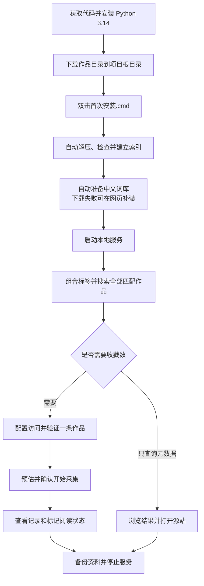

# EX资料库 · 本地 Tag 搜索

一个在本机运行的 **E-Hentai / ExHentai 作品元数据查询与记录工具**。导入作品目录后，可以在浏览器中组合中文或英文标签搜索作品，按需采集源站收藏数，并管理采集记录、阅读状态与资料备份。

程序使用 **Python 3.14 标准库 + SQLite + 原生 HTML / CSS / JavaScript**，无需安装第三方 Python 包或数据库服务。默认只监听本机 `127.0.0.1:8765`。

**首次使用只需：下载代码 → 安装 Python 3.14 → 放好作品目录压缩包 → 双击「首次安装.cmd」。** 程序会自动解压、建立索引、准备中文词库并打开网页，无需输入 PowerShell 命令。代码仓库不包含作品数据库、个人记录或登录凭据，下载代码后需要自行准备数据。

## 功能概览

| 功能 | 使用方式 |
| --- | --- |
| 本地标签搜索 | 中文 / 英文建议、完整标签精确匹配、多标签同时满足、标题与分类筛选 |
| 排除条件 | 本次排除标签与持久黑名单，可临时关闭黑名单 |
| 全范围查询 | 对全部匹配记录排序后分页，网页每页 40 条，支持页码跳转 |
| 收藏数采集 | 分轮、分批、全量三种模式；预估后确认；暂停、续抓与失败重试 |
| 已记录作品 | 查看成功与失败记录，按收藏数、标签、来源、时间等条件筛选 |
| 阅读管理 | 手动标记待看 / 在看 / 看过 / 不看，记录从已记录页面点开作品的次数 |
| 封面缓存 | 可见封面按需加载，首次下载后保存到本机 |
| 资料库维护 | 在线备份、校验并恢复备份、导入新版作品目录、意外中断恢复 |
| 中文标签 | 接入 EhTagTranslation 词库，网页检查与更新版本，更新后立即生效 |

这里的“收藏数”指**源站作品页面显示的收藏人数**；“已记录”指本程序保存的采集结果与失败记录。程序不管理源站账号的个人收藏夹，也不下载作品正文图片。

## 目录

- [环境要求](#环境要求)
- [首次安装与启动](#首次安装与启动)
- [日常启动与停止](#日常启动与停止)
- [搜索作品](#搜索作品)
- [采集收藏数](#采集收藏数)
- [查看记录与管理阅读状态](#查看记录与管理阅读状态)
- [封面显示与缓存](#封面显示与缓存)
- [备份与恢复](#备份与恢复)
- [更新作品目录](#更新作品目录)
- [更新中文词库](#更新中文词库)
- [命令行用法](#命令行用法)
- [项目结构与数据文件](#项目结构与数据文件)
- [常见问题](#常见问题)
- [数据时效与访问说明](#数据时效与访问说明)
- [开发与验证](#开发与验证)
- [第三方数据与许可](#第三方数据与许可)

## 环境要求

| 项目 | 要求 / 说明 |
| --- | --- |
| 操作系统 | 推荐 Windows，日常使用通过双击脚本和网页完成；加密登录文件等功能面向 Windows |
| Python | **3.14**；解压脚本使用该版本提供的 `compression.zstd`，Python 3.13 及更早版本不能直接运行完整流程 |
| 浏览器 | 可使用 Chrome、Edge 等现代浏览器 |
| 依赖 | 运行程序与 Python 单元测试只需标准库，无需 `pip install` |
| 磁盘 | 作品目录为大文件，需预留原始压缩包、解压数据库、索引及临时空间；完整备份和更新还需要额外空间 |
| 网络 | 下载目录、更新词库、首次读取未缓存封面、采集收藏数和打开源站链接时需要网络 |
| 源站访问 | 本地元数据搜索不要求登录；收藏数采集需要能访问所选源站的作品页 |

磁盘需求会随上游目录版本变化，请按实际文件大小预留空间。更新时会同时保留当前目录、准备好的新版目录和旧版保护备份，不能只预留一份数据库的空间。

## 首次安装与启动

### 1. 获取项目代码

在 GitHub 仓库页面选择 **Code → Download ZIP**，解压到一个固定文件夹；也可以使用 GitHub Desktop 克隆仓库。

后文的“项目根目录”指直接包含 `app.py`、`prepare_database.py` 和 `启动搜索.cmd` 的文件夹。不要在 ZIP 压缩包内直接运行脚本。

### 2. 安装 Python

从 [Python 官方下载页面](https://www.python.org/downloads/)安装 Python 3.14，并确保安装了 Windows Python 启动器，使 `py` 命令可用。

双击脚本会自动检查是否能启动 Python 3.14。未安装或启动器不可用时，窗口会显示安装提示；完成安装后重新双击即可。只安装其他 Python 版本或只有 `python` 命令时，这些脚本不能直接启动。

### 3. 下载作品目录

打开 [URenko/e-hentai-db 的 nightly 发布页](https://github.com/URenko/e-hentai-db/releases/tag/nightly)，下载 **`e-hentai.db.zstd`**，放到项目根目录。

使用 SQLite 格式的 `.zstd` 包，旧 MySQL 包不再更新。若浏览器保存为 `e-hentai.db (1).zstd` 等名称，请先整理为准确的 `e-hentai.db.zstd`。保留一份原始压缩包副本便于重新准备数据。

此时目录应类似：

```text
exhentai/
├─ app.py
├─ prepare_database.py
├─ initialize_catalog.py
├─ 首次安装.cmd
├─ 启动搜索.cmd
├─ static/
└─ e-hentai.db.zstd        # 自行下载，不在代码仓库中
```

### 4. 双击首次安装

双击项目根目录的 **`首次安装.cmd`**，保持窗口打开并等待。程序会依次：

1. 检查 Python 3.14 与本地压缩包。
2. 流式解压为 `data/catalog.sqlite3`，检查数据库结构。
3. 检查 SQLite 完整性、建立查询索引并生成目录概况。
4. 本地没有词库时下载官方中文词库。
5. 启动本地服务，在默认浏览器打开搜索页面。

**`启动搜索.cmd` 也具备相同的首次准备能力**，没有资料库时会自动准备，准备完成后的日常启动直接打开网页。已有作品目录、收藏资料和词库会保留，不会因为再次双击就重新覆盖。

大目录的解压、检查与索引需要等待，窗口会显示当前阶段。中断建索引后可以再次双击继续准备；中断解压留下 `.partial` 时，先按提示核对并另存未完成文件，再重新准备。避免同时开启多个准备窗口。

词库下载失败会显示提示并继续启动英文标签搜索。之后进入 **资料库维护 → 中文词库 → 安装中文词库**即可补装。后续更换作品目录使用[更新作品目录](#更新作品目录)，不要重新执行底层解压来覆盖旧库。

### 5. 确认可用

默认浏览器会打开 [http://127.0.0.1:8765](http://127.0.0.1:8765)。

确认页面已连接本地服务、显示作品记录数与标签数，再输入 `language:chinese`，从建议中选中并点击 **搜索资料库**。能看到结果，就完成了首次准备。

首次准备完成后，日常使用只需双击启动脚本，无需重复解压和建索引。



## 日常启动与停止

| 操作 | 方法 | 结果 |
| --- | --- | --- |
| 首次准备 | 双击 `首次安装.cmd` | 自动解压、建索引、准备词库并打开页面 |
| 开始使用 | 双击 `启动搜索.cmd` | 首次自动准备；以后按需启动后台服务并打开浏览器 |
| 查看已记录作品 | 页面侧栏点击 **已记录** | 打开 `/records` |
| 备份、更新、恢复 | 页面侧栏点击 **资料库维护** | 打开 `/maintenance` |
| 停止服务 | 网页 **停止服务 → 确认停止服务**，或双击 `停止搜索.cmd` | 暂停采集、等待已发出的请求结束、关闭服务 |
| 仅关闭浏览器 | 关闭网页 / 浏览器窗口 | 后台服务继续运行；已开始的采集继续执行 |

默认页面地址：

- 搜索首页：[http://127.0.0.1:8765](http://127.0.0.1:8765)
- 已记录：[http://127.0.0.1:8765/records](http://127.0.0.1:8765/records)
- 资料库维护：[http://127.0.0.1:8765/maintenance](http://127.0.0.1:8765/maintenance)

服务停止后，页面无法继续查询，需重新启动。备份、目录切换等维护任务进行中，程序暂不允许停止服务，以免中断操作。使用命令行维护脚本时，脚本会按需启动服务，完成后服务仍可继续使用。

## 搜索作品

### 基本操作

1. 在 **标签** 输入框输入中文或英文标签，选择建议；完整标签也可按 Enter 添加。
2. 添加多个标签时，作品必须**同时满足全部标签**，即 AND 关系。
3. 按需填写 **排除标签、标题关键词、作品分类、排序方式**。
4. 点击 **搜索资料库**。
5. 使用 **上一页 / 下一页** 或输入页码点击 **跳转**浏览结果。
6. 在 **打开作品时使用** 中选择 ExHentai 或 E-Hentai，再点击作品标题打开源站。

搜索至少需要一个包含标签或标题关键词；只选择分类、排序或排除条件不能发起搜索。标题关键词对原标题与日文标题作文字包含匹配，不会自动翻译标题。

### 标签输入规则

| 输入方式 | 示例 | 说明 |
| --- | --- | --- |
| 完整英文键 | `language:chinese` | 按数据库中的完整标签精确匹配 |
| 中文译名 | `中文`、`汉语` | 词库可用时解析为对应标签；有歧义时需从建议选择 |
| 命名空间缩写 | `l:chinese`、`lang:chinese` | 自动展开为 `language:chinese` |
| 末尾精确标记 | `language:chinese$` | 接受末尾 `$`，内部按完整标签匹配 |

常用缩写：`l` / `lang` → `language`，`a` → `artist`，`g` → `group`，`c` → `character`，`p` → `parody`，`o` → `other`，`f` → `female`，`m` → `male`，`x` → `mixed`。

输入片段可以获得建议，但正式搜索使用完整标签。已选标签显示中文译名与原始英文键；结果标签显示中文，悬停可查看英文。未翻译的标签保留原文。

一次最多包含 **12 个标签**、明确排除 **200 个标签**；每个输入项与标题关键词最多 **200 个字符**。

### 排除标签与持久黑名单

- **排除标签**只用于本次搜索，命中任意一个排除标签的作品都会被排除。
- 点击 **将当前排除标签加入黑名单**，可以长期保存这些排除项。
- 持久黑名单默认用于后续搜索；取消 **本次搜索应用持久黑名单** 可以临时关闭。
- 点击黑名单标签的移除按钮可以删除该项。清空普通搜索条件不会删除已保存的黑名单。
- 同一个标签不能同时被包含和排除；如果它在黑名单内，先移除或临时关闭黑名单。
- 黑名单保存在 `data/favorites.sqlite3`，重启后保留，也会随收藏资料备份。

例如，包含 `language:chinese` 和 `other:anthology`，会搜索同时属于中文与合集的作品；排除条件与黑名单会在这个范围上继续过滤。

### 排序与历史记录

搜索支持发布时间从新到旧 / 从旧到新、平均评分从高到低、作品页数从多到少、已采集收藏数从高到低排序。排序针对**全部匹配记录**执行，然后分页；选择收藏数排序时，未知值的作品始终排在已知值之后。

默认排除数据库标记为 `removed`、`expunged`、`replaced` 的记录。勾选 **包含已移除、已隐藏及旧版本记录**，可以将这些历史记录纳入搜索。

收藏数最初显示 **未知**，需要主动采集后才有数值；零收藏是成功读取的有效数值，与未知不同。搜索结果会显示收藏数覆盖数量与近 7 天更新数量，便于判断收藏排序的覆盖程度。

## 采集收藏数

采集会请求所选源站的作品详情页，读取收藏人数，写入独立的 `data/favorites.sqlite3`。**候选来自本次搜索的全部匹配作品，不受当前页限制。** 本地搜索与采集是两个操作，点击搜索不会自动采集收藏数。

### 1. 配置源站与登录信息

先完成一次搜索，展开搜索框下方的 **收藏数采集**，建议第一次用匹配数量较少的条件验证访问。

1. 在 **采集源站** 选择自己能够访问的站点。
2. ExHentai 需要填写 `ipb_member_id`、`ipb_pass_hash`、`igneous` 三项 Cookie 的 **Value**。E-Hentai 可以先不填写 Cookie 尝试公开访问。
3. 在 Chrome / Edge 打开正常可访问的源站作品页，按 **F12 → 应用（Application）→ 存储 → Cookies**，选择对应域名并找到三项值。
4. 将值填入本地表单，按需设置代理、间隔、缓存周期与采集模式，再点击 **应用本次设置**。

只填写每项的 Value，不要复制完整请求头，也不要把 Cookie 发到聊天、Issue 或提交到 GitHub。

| 设置 | 网页默认值 | 可选范围 / 行为 |
| --- | --- | --- |
| 采集源站 | ExHentai | ExHentai / E-Hentai；继续已有任务时必须与原任务一致 |
| 请求间隔 | 4 秒 | 3～60 秒；通常在上次请求结束后等待设定间隔 |
| 缓存刷新周期 | 7 天 | 1 / 7 / 30 天，或自定义 1～3650 天 |
| 采集模式 | 分轮抓取 | 分轮 / 分批 / 全量，详见下表 |
| 每轮 / 每批数量 | 1,000 条 | 100 / 300 / 1,000 / 3,000 / 5,000，或自定义 1～100,000 条 |
| 按平均评分优先 | 关闭 | 控制新队列的候选顺序，与搜索结果排序分别设置 |
| 跳过已有收藏数 | 关闭 | 开启后仅补充从未成功取得收藏数的作品，不看缓存年龄 |
| HTTP 代理 | 留空 | 网络已可访问时可留空；需代理时填写 HTTP / HTTPS 地址，例如 `http://127.0.0.1:7890`，端口以实际配置为准 |

代理字段不支持 `socks5://`、用户名密码、查询参数或额外路径。收藏数采集表单的代理只用于收藏数请求，不控制封面下载或词库更新。

### 2. 选择采集模式

| 模式 | 建立任务时保存什么 | 完成后如何继续 | 适用场景 |
| --- | --- | --- | --- |
| **分轮抓取** | 按跳过规则筛选后，保存全部待抓取队列、顺序和轮次；首次只执行第 1 轮 | 每轮结束自动停止，手动预估并确认下一轮 | 逐步覆盖一个较大的固定范围，跨多次启动续抓 |
| **分批补充** | 保存本次挑选的一批候选与原始搜索范围 | 完成本批后，按原始范围重新预估并追加下一批 | 按次补充记录，逐步抽样或刷新 |
| **全量采集** | 保存整个范围的待处理任务 | 运行到完成或手动暂停，不按轮自动停止 | 希望连续处理全部待抓取作品 |

分轮与分批的数量表示作品条数，不包含独立的单条验证；失败重试可能产生额外请求。

例如，按跳过规则计算后有 10,000 条待抓取作品，每轮 1,000 条，则建立 10 轮。最后一轮不足设定数量时，只处理剩余作品。这个例子仅用于说明轮次计算，不是数据库固定规模。

### 3. 验证、预估并确认

1. **应用本次设置**：让本地服务接收表单设置。
2. **验证并读取一条**：实际读取符合当前跳过规则的作品，验证访问并保存结果。遇到 `Gallery not found`、作品已删除或 HTTP 404 等单条不可访问情况，会记录失败并尝试下一条，一次最多请求 3 条，仍遵守请求间隔；它们不会被判为登录失效。登录提示、浏览器验证和未知页面仍会停止验证。全部可跳过时不发送请求。
3. **预估采集耗时**：只读取本地数据，核对全范围数量、待抓取数量、缓存跳过数、轮数 / 批量与留待后续的数量。
4. 确认范围无误后点击 **确认开始采集**。分轮模式的预估耗时与首次执行范围都是第 1 轮。
5. 查看顶部进度卡；需要最新排名时点击 **刷新搜索结果**，或进入 **已记录**。

可在验证前先预估，但实际启动仍须先完成访问验证。预估本身不建立任务、不访问源站；只有单条验证和确认后的采集才请求作品详情页。

预估按 `待抓取数量 ×（请求间隔 + 单条读取耗时）` 计算。读取耗时优先使用最近最多 20 次成功请求的平均值；没有实测值时按每条 2 秒估算，并在界面注明。估算不包含失败重试、源站限流与人为暂停；全部跳过时预计耗时为零。

预估有效期为 **10 分钟**。修改设置、搜索范围、缓存或队列后，需要重新预估，旧确认不能启动其他范围的任务。

### 4. 候选选择与缓存规则

**评分优先关闭时：** 分轮 / 分批先应用缓存规则，优先从未成功记录的作品，再优先此前没有尝试过的候选；按发布时间分年份轮流分配名额，各年份内部按平均评分降序、作品 ID 降序选择。年份不足时由其他年份补足，未知发布时间单列一组。全量模式默认按作品 ID 从新到旧执行。

**评分优先开启时：** 分轮 / 分批不再均衡年份，而是先处理此前未尝试的候选，再按平均评分降序、作品 ID 降序排列；全量模式也使用这个评分优先顺序。评分来自基础目录快照，不是收藏数，也不是评分人数。

**缓存规则：**

- 未开启“跳过已有收藏数”时，成功采集且未超过缓存天数的记录会复用；未知或过期记录需要抓取。
- 开启 **只抓取从未成功采集过的作品，跳过已有收藏数** 后，所有成功记录都跳过，不受缓存年龄影响；成功读取的零收藏也会跳过。
- 从未成功的失败项仍可补抓。默认分批选择会优先新候选，避免失败项反复占满下一批。
- 超过缓存周期不会自动发起刷新，只在再次主动建立 / 继续任务并应用跳过规则时决定是否请求。
- “未纳入本轮 / 本批”与“缓存已跳过”分别统计，未采集作品不会被标成已完成。

按评分挑选的一批作品不一定是收藏数最高的作品。覆盖不足时，收藏排名只能代表已经采集的部分。

### 5. 暂停、续抓与关闭后恢复

| 操作 | 行为 |
| --- | --- |
| 暂停本轮 / 暂停任务 | 等待当前已发出的请求结束，保留已获得的收藏数与剩余队列 |
| 继续本轮 | 预估并确认后，处理已开启轮次中仍待处理的项目 |
| 继续第 N 轮 | 分轮模式在上一轮结束后手动开启下一轮，不会自动连跑 |
| 重试失败项 | 先预估再确认，处理原任务已开启轮次内的失败项；不会开启后续轮次 |
| 预估并追加下一批 | 分批任务完成后，按原始搜索范围重新挑选下一批 |
| 结束任务 | 结束当前整个计划，保留已采集结果；需要新范围时再建立新任务 |

队列、轮次与进度保存在 SQLite 中。**关闭浏览器不会暂停后台采集**：分轮会运行至当前轮结束，分批 / 全量继续运行至任务完成或暂停。停止服务后，重新启动时任务不会自行请求源站。

重启后恢复已有计划：

1. 双击 **启动搜索.cmd**，首页会显示已保存的进度卡，不必重新搜索原来的标签。
2. 重新填写访问设置，或导入加密登录文件，并确保源站与原任务一致。
3. 点击 **应用本次设置**，再点击 **验证原任务的源站访问**。
4. 轮中暂停时选择 **继续本轮**；一轮已完成时选择 **继续第 N 轮**，预估后确认。

分轮计划建立后，后续队列、每轮数量与顺序固定；更改搜索条件、每轮数量、评分优先开关或基础目录不会替换这个计划。继续时会按当前跳过规则复用已经取得的收藏数。未完成计划需要先继续或结束，才能建立新任务。

“已处理”与进度条包含失败和跳过项目，不表示每条都成功。可先重试已经开启轮次的失败项，也可继续后续轮次。分轮计划只有整个计划完成时，才触发“任务完成后自动备份”。

### 6. 登录信息与加密文件

- Cookie 默认只保存在本次服务运行的**内存**中，不写入数据库、日志或浏览器本地存储。刷新网页不清除设置，停止服务后需重新配置。
- 同一源站已有设置时，三项 Cookie 输入框全部留空可以沿用本次内存中的值；更换源站或重新填写时需提供相应信息。
- 应用设置后可点击 **导出加密登录文件**，保存 `.ehcred`；下次点击 **导入加密登录文件**即可重新加载访问设置。
- 文件使用 Windows DPAPI 加密，面向同一台电脑上的当前 Windows 用户；换电脑或换 Windows 用户后不能作为通用登录备份使用。
- 登录文件保存源站、代理与 Cookie，不保存全部采集参数。导入后仍需核对模式、间隔等设置，并执行一次访问验证。
- 程序资料库备份不包含 `.ehcred`，Git 默认忽略此扩展名。请单独妥善保管。
- 只更改缓存天数、跳过选项或请求间隔，源站 / 代理 / Cookie 未变时，可以沿用本次已验证状态；重启服务后仍需重新验证。

### 7. 失败与限流处理

读取失败不会将上次成功的收藏数清零。临时网络错误会等待后重试，最多尝试 3 次；作品不可访问等终止错误会记录为失败项。

登录失效、浏览器验证页、未知页面格式或限流会暂停整个任务。HTTP 429 的冷却时间会保存到数据库，重启程序不会清除限制；等冷却结束并核对访问后再继续。需要浏览器验证时，在源站浏览器中处理，然后回到本地页面重新验证。

进度卡默认折叠失败详情，展开可查看最近 5 条失败原因与访问链接；点击 **在已记录中查看全部失败作品**，可以查看原任务的全部未解决失败作品。

## 查看记录与管理阅读状态

进入 **已记录** 或 [http://127.0.0.1:8765/records](http://127.0.0.1:8765/records)。该页面使用本地数据，点击 **刷新记录** 不会重新采集源站收藏数，也不要求提供 Cookie。

### 查看成功与失败记录

- 默认展示全部成功与失败作品，每个作品只显示一张卡片；可切换 **全部记录 / 采集成功 / 抓取失败**。
- 默认按收藏数从高到低排序，未知值置后；切换失败列表时默认按失败记录时间从新到旧排序。
- 支持标题 / 作品 ID、中文或英文标签、采集来源、记录时间、阅读状态与是否点开组合筛选。多个标签必须同时满足。
- 记录时间可选择全部、最近 7 / 30 / 90 天、30 天以前；成功记录使用成功采集时间，失败列表使用失败记录时间。
- 可按收藏数升 / 降序、采集时间新 / 旧、平均评分或标记时间排序，支持分页与页码跳转。
- 卡片展示收藏数、采集时间、来源、原标题和标签；标签完整显示并按画师、原作、角色、语言等命名空间分组。点击标签可在已记录范围内筛选。
- 零收藏、旧版本、已移除记录均保留。基础目录更新后找不到元数据时，仍显示作品 ID、收藏数或失败信息、时间；失败项可使用队列保存的原始访问链接。

曾成功采集但最新刷新失败的作品显示 **刷新失败**，保留上次成功数值和时间；从未成功的作品显示 **尚未取得收藏数**。重试期间失败记录仍保留，成功后自动移出失败列表。旧队列的未解决失败项会自动导入；旧版没有逐条失败时间时，使用对应任务的更新时间。

每个作品当前保留一份最近成功结果与当前未解决失败信息，没有保存每次收藏数变化的历史曲线。

### 点开次数与阅读状态

**点开记录**与**阅读状态**分别保存：

| 状态 / 指标 | 含义 |
| --- | --- |
| 未分类 | 尚未手动分类 |
| 待看 | 准备之后查看 |
| 在看 | 正在查看 |
| 看过 | 已查看，由用户手动标记 |
| 不看 | 暂不考虑查看 |
| 点开次数 / 最近点开时间 | 从“已记录”页面点击作品标题或“查看源站”的本地记录 |

单张卡片可以修改阅读状态，也可勾选多条 / 选择当前页，再点击 **应用到已选记录**批量设置；一次最多更新 1,000 条。顶部状态统计可以快捷筛选。

点击作品不会自动变为“看过”。从其他页面、浏览器标签页或设备打开作品，程序无法感知，因此“已点开”只代表从已记录页面发起过打开操作，不证明源站加载成功或已经阅读。

这些标记保存在 `data/favorites.sqlite3`，重新采集、更新基础目录和普通备份都会保留；失败作品也能标记，之后采集成功仍保留。**恢复未分类**只清除手动分类，不清除点开次数与时间。导入旧备份则会将这些资料恢复为备份中的状态。

## 封面显示与缓存

搜索和已记录页面的封面由本地服务代理读取。浏览器获得本地 `/api/cover/{gid}` 地址，接近可见区域时才加载，不会提前下载整个目录的封面。

| 项目 | 行为 |
| --- | --- |
| 来源 | 只接受数据库中的 `ehgt.org`、`s.exhentai.org`、`exhentai.org` 封面地址，统一改写为公开的 `https://ehgt.org` |
| 登录信息 | 不携带 Cookie 或 Authorization，不使用收藏数采集的登录信息，不访问作品详情页 |
| 本地缓存 | 成功文件保存在 `data/covers/`，索引为 `data/covers.sqlite3`；相同封面复用缓存 |
| 请求限制 | 最多同时下载 3 张，新远程请求起始间隔至少 0.25 秒 |
| 文件检查 | 单张最多 8 MiB，仅接受经文件头验证的 JPEG / PNG / GIF / WebP |
| 失败处理 | 显示本地占位图，同一失败地址 24 小时内不重复请求；HTML 等错误响应不写入图片缓存 |
| 备份 | 封面可重新生成，不包含在轻量或完整资料库备份中 |

封面缓存的数量、体积、失败数与位置可在 **资料库维护 → 封面缓存**查看。离线时仍可查询本地元数据，但未缓存的封面不能下载。收藏数表单中的代理设置不用于这些封面请求。

## 备份与恢复

进入 **资料库维护** 或 [http://127.0.0.1:8765/maintenance](http://127.0.0.1:8765/maintenance)。

### 选择备份位置

默认位置为项目的 `backups/`。点击 **选择文件夹**，或输入另一个磁盘、移动硬盘、已连接网络共享文件夹的完整路径，再点击 **保存位置**。不存在的文件夹会自动创建，**恢复默认**可切回项目内的 `backups/`。

选择独立的备份文件夹，不要使用项目根目录、`data/` 或 `static/`。手动备份、自动备份、目录更新与备份导入前的保护备份都使用当前保存的位置。切换位置不会移动或删除原位置的备份。

### 手动与自动备份

| 备份类型 | 内容 | 建议用途 |
| --- | --- | --- |
| **轻量备份** | 收藏数、失败记录、阅读状态、黑名单、采集队列与进度、中文词库、相关元信息、程序与静态页面文件 | 日常保留个人资料，体积较小 |
| **完整备份** | 轻量备份内容，加上完整 `catalog.sqlite3` 作品目录 | 目录更新前保护、迁移或从零恢复 |

网页点击 **立即备份**创建轻量备份；勾选 **同时备份作品目录**后创建完整备份。可以在线备份，无需先停止服务。SQLite 使用 backup 接口，已提交但仍在 WAL 中的数据也会纳入。

也可以双击：

| 脚本 | 功能 |
| --- | --- |
| `备份资料库.cmd` | 轻量备份 |
| `完整备份资料库.cmd` | 完整备份 |
| `导入新版目录.cmd` | 准备已下载的目录、保护备份旧版并应用新版 |

开启 **采集任务完成后，自动备份到上述位置**，会在任务完成时创建轻量备份，含存在失败项的完成状态。该功能默认关闭，按任务完成触发，不是后台定时备份；分轮尚有下一轮时不触发。

每份备份有独立文件夹和 `manifest.json`，记录文件大小及 SHA-256。文件夹名称中的 `Z` 表示 UTC 时间。维护页只显示当前位置最近 10 份，**不会自动删除更早备份**。失败或中断的备份保留为 `.partial` 文件夹，不列为成功备份。

两种备份都不包含 Cookie、`.ehcred`、日志、原始 `.zstd` 压缩包或封面缓存。`tests/` 与 Git 提交历史也不在应用备份范围内。

### 导入已有备份

1. 在最近备份中点击 **导入这份**，或选择 / 粘贴具体备份文件夹的完整路径。
2. 该文件夹应直接包含 `manifest.json`，不要选择存放多份备份的父目录。
3. 需要恢复完整目录时，勾选 **同时恢复作品目录**；这要求所选备份是完整备份。
4. 点击 **检查备份**。程序校验清单中所有文件的大小与 SHA-256，并暂存待恢复资料。
5. 核对收藏数记录、阅读状态标记和采集计划数量，勾选确认。
6. 点击 **备份当前资料并导入**。程序暂停采集、等待当前请求完成，自动保护备份当前对应资料，然后导入。
7. 完成后刷新页面。导入后的采集计划保持暂停，核对登录设置并验证后再继续。

**导入会替换对应个人资料**，包括收藏数、失败记录、阅读状态、黑名单与采集进度，并恢复备份内的中文词库。轻量备份保留当前作品目录；完整备份可同时恢复目录。

网页导入只恢复数据，不执行或覆盖备份里的程序文件；当前备份位置、自动备份选项与服务内存中的登录设置保留。失败会回退原资料；切换时意外退出，下次启动会检查恢复记录。

### 换电脑或原项目丢失

- **有完整备份：** 可以将备份内的程序文件、`static/` 与 `data/` 复制到一个新的空项目文件夹，安装 Python 3.14 后启动验证。若还需要开发测试与完整代码历史，另外获取代码仓库。
- **只有轻量备份：** 获取项目代码并先按首次流程准备基础目录，再启动服务，通过维护页导入这份备份。
- 新电脑需要重新配置源站登录信息；原电脑导出的 `.ehcred` 不能作为跨设备凭据使用。
- 如果目标位置已有项目或资料，先核对并另做备份，不要直接覆盖已有非空目录。

## 更新作品目录

该操作用于**已经完成首次准备**的资料库，只更新基础作品目录，保留个人收藏资料与中文词库。

1. 从 [nightly 发布页](https://github.com/URenko/e-hentai-db/releases/tag/nightly)下载新版 `e-hentai.db.zstd`，放到项目根目录，文件名保持准确。
2. 打开 **资料库维护 → 更新作品目录**，可选填写可信来源提供的 64 位 SHA-256 校验值。
3. 点击 **检查并准备新版目录**。程序计算压缩包校验值、流式解压到临时目录、检查完整性并建立索引；准备期间旧目录仍可查询。
4. 核对当前目录与候选目录的作品数、标签数和最新作品发布日期。较旧快照需要明确勾选允许使用。
5. 点击 **备份旧版并应用更新**。程序暂停采集、等待当前请求结束、完整备份旧版，再切换目录。
6. 完成后点击 **刷新页面，查看新目录**；需要续抓时，再按进度卡操作。

网页更新不退出服务，内存中的登录设置会保留；`favorites.sqlite3` 中的收藏数、阅读状态、黑名单和任务队列不会因目录更新被替换。已经建立的分轮计划仍使用保存好的队列与顺序。

双击 **`导入新版目录.cmd`** 可自动完成准备、备份和切换；检测到较旧快照时会停止，交由网页核对。维护导入已应用过的相同压缩包会按 SHA-256 识别并跳过。

这里的“自动”只指处理已经下载好的本地文件；程序没有定时从 GitHub 下载新版目录的功能。

解压或校验失败不会替换当前目录，失败暂存文件保留在 `data/.maintenance/`；切换失败会回退旧版，意外退出会在下次启动时尝试恢复。实际切换阶段会短暂停止新的搜索访问，维护进度仍可查看。

## 更新中文词库

进入 **资料库维护 → 中文词库**，可以看到本地版本、词条数量、词库日期、官方最新版与最近检查时间。

1. 点击 **检查更新**。程序查询 [EhTagTranslation/Database](https://github.com/EhTagTranslation/Database) 官方发布信息，对比本地版本，不安装词库。
2. 查看结果：**已是官方最新版本 / 发现新版词库 / 尚未安装 / 需要核对词库版本**。本地版本信息不足时不会宣称已是最新版；网络失败会明确显示失败信息，可以重试。
3. 点击 **更新到最新版**；未安装时按钮显示 **安装中文词库**。程序后台下载官方 `db.text.json.gz`，按官方提供的 SHA-256 校验，检查词库内容后安装。
4. 等待页面显示 **中文词库更新成功，已立即生效**。已是最新版时会提示无需重复下载；失败时显示原因，原有词库保留。
5. 刷新已经打开的搜索或记录页，即可显示新译名，**无需停止或重新启动服务**。

检查与更新需要网络，页面打开和日常搜索不会自动查询外部版本。更新不会清除内存中的登录设置、收藏数、阅读状态或采集队列，也不会暂停正在运行的收藏采集。其他维护任务执行时，请等待完成再更新。

更新成功时，上一份词库保存为 `data/tag-translations.previous.json`。词库与作品目录独立更新，汉化只用于标签显示和检索，不修改数据库原始标签键，也不翻译作品标题。

高级用户仍可在命令行执行 `py -3.14 update_translations.py`；命令行更新不自动通知正在运行的服务，需要重新启动服务，或在网页点击更新来载入已安装的最新版。仅检查可用 `py -3.14 update_translations.py --check`。

## 命令行用法

以下命令都在项目根目录执行。

### 常用命令

```powershell
# 自动完成首次准备并打开网页
py -3.14 launch.py

# 需要逐项处理时，手动准备作品目录
py -3.14 prepare_database.py
py -3.14 initialize_catalog.py

# 更新词库
py -3.14 update_translations.py

# 启动服务并打开浏览器
py -3.14 launch.py

# 启动服务但不打开浏览器
py -3.14 launch.py --no-browser

# 停止默认端口上的服务
py -3.14 launch.py --stop

# 在线轻量 / 完整备份
py -3.14 -X utf8 maintenance.py backup
py -3.14 -X utf8 maintenance.py backup --full

# 导入根目录中已经下载的新版压缩包
py -3.14 -X utf8 maintenance.py import
```

`initialize_catalog.py` 的命令行入口使用默认 `data/catalog.sqlite3`，没有自定义路径参数；维护页会为候选目录调用同一初始化逻辑。

### 前台运行与自定义端口

```powershell
# 在当前终端运行，便于查看启动错误
py -3.14 app.py

# 自定义端口示例
py -3.14 app.py --port 8766
```

自定义端口示例的页面地址为 [http://127.0.0.1:8766](http://127.0.0.1:8766)。`launch.py`、双击脚本和命令行维护工具固定使用 **8765**，不会自动连接自定义端口；使用自定义端口时，通过该端口的网页维护 / 停止服务，或在前台终端按 Ctrl+C 结束。

### 可选校验与路径参数

```powershell
# 使用其他位置的压缩包，仍解压到默认数据库
py -3.14 prepare_database.py --source "D:\Catalog\e-hentai.db.zstd"

# 将下面占位文字替换为可信来源提供的 64 位校验值
py -3.14 prepare_database.py --sha256 "压缩包的SHA-256值"
py -3.14 update_translations.py --sha256 "词库压缩包的SHA-256值"
```

上面两条 `--sha256` 命令是模板，执行前替换占位文字。也可用 PowerShell 检查本地文件：

```powershell
Get-FileHash .\e-hentai.db.zstd -Algorithm SHA256
```

校验需要与可信来源公布的值比较，只有自己计算出的值不能证明下载文件与来源一致。

`prepare_database.py` 另有 `--database`，`app.py` 也支持 `--database`，词库更新支持 `--url`；这些是高级入口。普通使用保持默认路径，便于启动脚本、索引初始化和维护功能协同工作；不要用底层解压命令替代已有目录的维护更新流程。

## 项目结构与数据文件

```text
exhentai/
├─ app.py                      # 本地 HTTP 服务、搜索、已记录与维护接口
├─ launch.py                   # 后台启动、打开页面、停止默认服务
├─ first_run.py                # 首次解压、建索引与词库准备
├─ prepare_database.py         # Zstandard 流式解压与表结构检查
├─ initialize_catalog.py       # SQLite 检查、索引与目录概况
├─ translations.py             # 译名解析、命名空间与标签建议
├─ update_translations.py      # 检查官方版本、校验并更新中文词库
├─ favorites.py                # 收藏数解析、缓存、队列、失败与阅读状态
├─ credentials.py              # Windows DPAPI 登录文件导入 / 导出
├─ covers.py                   # 公开封面代理与本地缓存
├─ maintenance.py              # 备份、恢复、新目录准备与切换
├─ static/                     # 搜索、记录、维护页面及样式和脚本
├─ tests/                      # Python 单元测试与浏览器回归脚本
├─ 首次安装.cmd
├─ 启动搜索.cmd
├─ 停止搜索.cmd
├─ 备份资料库.cmd
├─ 完整备份资料库.cmd
├─ 导入新版目录.cmd
├─ README.md
├─ THIRD_PARTY_NOTICES.md
├─ .gitignore
├─ e-hentai.db.zstd             # 自行下载；Git 忽略
├─ data/                       # 本地资料；Git 忽略
├─ logs/                       # 日志与运行信息；Git 忽略
└─ backups/                    # 默认备份位置；Git 忽略
```

| 文件 / 目录 | 用途 | 处理建议 |
| --- | --- | --- |
| `data/catalog.sqlite3` | 基础作品目录与本地查询索引 | 可重新导入；更新优先使用维护页 |
| `data/catalog_info.json` | 作品数、标签数、日期、初始化摘要 | 与当前目录配套保存 |
| **`data/favorites.sqlite3`** | 收藏数、失败、队列、阅读状态、点开次数与黑名单 | **个人资料核心文件，优先做好备份** |
| `data/tag-translations.json` | 中文词库 | 可单独更新，备份包含 |
| `data/tag-translations-info.json` | 词库来源、版本与校验摘要 | 随词库保存 |
| `data/tag-translations-check.json` | 最近一次官方版本检查结果 | 本机状态，不进入资料备份 |
| `data/tag-translations.previous.json` | 上一份词库 | 更新成功时生成，不在应用备份清单内 |
| `data/maintenance-settings.json` | 备份位置与自动备份配置 | 本机配置；网页恢复保留当前设置 |
| `data/covers/`、`data/covers.sqlite3` | 封面文件与缓存索引 | 可重新生成，不进入资料备份 |
| `data/.maintenance/` | 目录更新与备份恢复的暂存区 | 维护失败时先核对，不要在任务执行中清理 |
| `logs/server.log` | 后台启动与运行诊断 | 启动失败时查看，不上传 |
| `logs/server-8765.json` | 本次默认服务的运行信息与本地操作令牌 | 程序管理，不上传或分享 |
| `backups/` 或自定义位置 | 带校验清单的独立备份 | 与源码分开保存，不上传个人备份 |
| `*.ehcred` | 加密登录文件 | 单独保管，换机时重新配置 |

不要在服务运行中直接复制单个 SQLite 主文件当作完整备份：已经提交的数据可能仍在 WAL 中。使用网页或备份脚本可以得到一致性副本。

## 常见问题

| 现象 | 排查与处理 |
| --- | --- |
| 提示 `py` 不存在 / 找不到 Python 3.14 | 安装官方 Python 3.14 和 Windows 启动器，重新打开 PowerShell，检查 `py -3.14 --version` |
| 提示没有 `compression` / `compression.zstd` | 当前解释器版本不符；使用 `py -3.14`，不需要安装同名第三方包 |
| 启动脚本提示数据库缺失 | 将准确命名的 `e-hentai.db.zstd` 放到根目录，再双击 `首次安装.cmd` 或 `启动搜索.cmd` |
| 解压提示已有 `.partial` | 上次解压中断；先确认没有解压 / 维护任务运行，核对并另存未完成文件后，再重新准备。不要直接把 `.partial` 改名为正式数据库 |
| 解压或更新提示空间不足 | 分别检查资料库磁盘和备份磁盘，为新版暂存目录、索引和完整保护备份预留空间；仅更改备份位置不一定能满足项目磁盘的准备空间检查 |
| 放了新压缩包但目录没有变化 | 底层解压脚本不覆盖旧库；已有资料库使用维护页或 `导入新版目录.cmd` |
| 浏览器无法连接 `127.0.0.1:8765` | 重新运行 `启动搜索.cmd`；仍失败时查看 `logs/server.log`，或用 `py -3.14 app.py` 查看前台错误 |
| 提示 8765 被其他程序占用 | 核对占用程序，或使用 `app.py --port 8766` 前台运行；注意默认脚本仍连接 8765 |
| 中文标签没有建议 / 显示英文 | 在「资料库维护 → 中文词库」安装或更新，然后刷新搜索页面；上游未收录的标签保留英文 |
| 中文词库检查或更新失败 | 在词库卡片查看失败原因，确认能访问 GitHub；受到查询限制时稍后重试，原有词库不会因失败被覆盖 |
| 提示标签不存在 / 中文有歧义 | 从建议选择具体命名空间下的完整标签；确认包含与排除条件没有冲突 |
| 搜索结果少于预期 | 检查黑名单、排除标签、分类，以及是否包含历史记录；多标签是同时满足关系 |
| 搜索超时 / 正在处理其他查询 | 等当前查询完成，增加具体标签缩小范围；大目录上的宽泛标题查询可能较慢 |
| 收藏数全部未知 | 作品目录不自带收藏数，需配置访问、验证并主动采集；未知不表示零收藏 |
| 显示尚有未完成计划，不能新建 | 在进度卡继续原计划，或点击结束任务后再创建新范围 |
| 重启后不能继续采集 | 重新应用登录 / 代理设置、验证原任务访问，确保源站一致，再预估并继续 |
| 修改采集设置提示等待请求结束 | 先暂停，等当前请求结束后再应用；暂停不是立即中断已发出的网络请求 |
| ExHentai 验证失败 / 登录失效 | 在浏览器确认能够访问同一源站作品页，核对三项 Cookie 的 Value 与代理；更新设置后重新验证 |
| 提示 HTTP 429 / 冷却未结束 | 等待保存的冷却时间结束；重启不会消除限制，可增加请求间隔后再继续 |
| `.ehcred` 无法导入 | 确认由当前 Windows 用户在同一电脑导出且未损坏；换机 / 换用户时重新填入并导出 |
| 封面占位但搜索正常 | 检查公开封面来源能否访问；失败地址缓存 24 小时，收藏数代理或登录成功不代表封面网络正常 |
| 检查备份提示清单缺失 / 校验失败 | 选择具体含 `manifest.json` 的完成备份文件夹；`.partial` 或缺文件 / 被修改的备份不能导入 |
| 完整备份选项无法用于恢复 | 所选备份可能是轻量备份；取消同时恢复目录，或选择确实含目录的完整备份 |
| 关闭网页后采集仍继续 | 正常行为；使用暂停或停止服务按钮结束后台运行 |

## 数据时效与访问说明

- 基础目录是本地快照，作品、标签与可见性可能已经变化；库内“最新作品发布日”不等于全库数据都更新到了该日。
- 收藏数是每个作品最近成功读取时的快照，缓存不会实时变化。即使已覆盖全部匹配记录，也不是源站实时排行榜。
- 元数据查询、标签建议、预估、查看记录与阅读标记使用本地数据；首次加载未缓存封面会访问公开图片站点。
- 只有主动验证或确认采集，程序才请求所选源站的作品详情页；打开作品链接会让浏览器访问源站。
- 本地服务只供本机访问，不提供多人账号、公网部署或远程设备共享功能；GitHub Pages 不能直接运行这个 Python / SQLite 服务。
- 登录 Cookie 默认只存内存；程序不将搜索词写入请求日志，也不需要将登录值填进源码或 `.env`。
- Git 忽略个人资料可以防止它们进入正常的新提交，但应用备份仍包含个人记录和本机配置，应在自己的设备上保管。

## 开发与验证

项目没有第三方 Python 运行依赖，修改服务端代码后重启本地服务；修改前端静态文件后刷新页面，必要时使用 Ctrl+F5 强制刷新。

运行 Python 单元测试：

```powershell
py -3.14 -m unittest discover -s tests -v
```

测试使用临时目录 / 数据库、模拟源站响应，覆盖查询、标签汉化、收藏数解析与缓存、预估确认、分批 / 分轮队列、失败记录、阅读状态、封面处理、加密登录文件、在线备份、目录更新回退、恢复与停止服务等行为，不需要真实账号或真实采集。真实源站访问需在本地页面通过 **验证并读取一条**单独确认。

`tests/visual_*.cjs` 与 `tests/visual_collector_server.py` 是浏览器回归辅助脚本，使用 Node.js / Playwright 等额外开发工具，不属于普通运行依赖，也不会随上述 `unittest` 命令执行。部分脚本包含本机测试环境路径，运行前需按自己的环境调整。

## 第三方数据与许可

- **基础作品目录：** [URenko/e-hentai-db](https://github.com/URenko/e-hentai-db)，由用户从发布页自行下载。
- **中文标签词库：** [EhTagTranslation/Database](https://github.com/EhTagTranslation/Database)，版权归 EhTagTranslation 全体编辑者，文本许可为 [CC BY-NC-SA 3.0 CN](https://creativecommons.org/licenses/by-nc-sa/3.0/cn/)。

词库与作品元数据库是独立的数据来源。使用或再分发译文数据时，请保留署名和许可链接，并遵守非商业性使用与相同方式共享要求。详细来源、数据形式与上游说明见 [THIRD_PARTY_NOTICES.md](THIRD_PARTY_NOTICES.md)。

当前仓库未附单独的源码 LICENSE；以上第三方译文许可不等同于项目源码的许可证。
