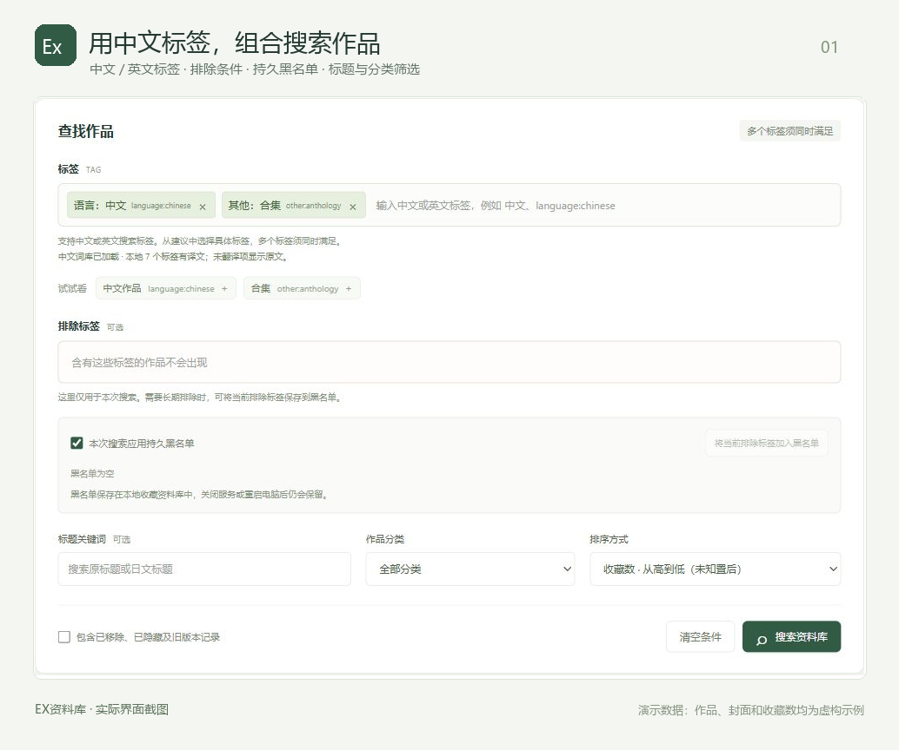
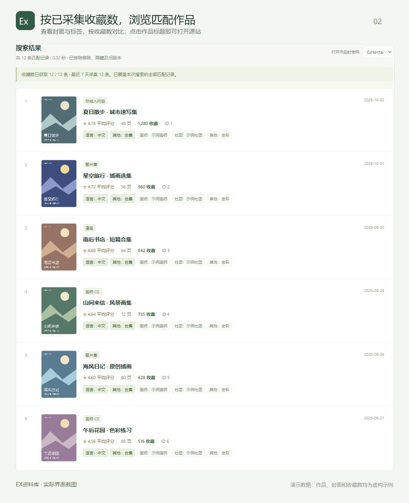

# 分享一个自己做的 E/EX 本地资料库：中文标签搜索、收藏数排序、阅读记录管理

最近做了一个 Windows 小工具「EX资料库」，主要是想让找作品、整理记录更方便一点。

它可以用来：

- **用中文找作品**：支持中文／英文标签组合搜索，也能按标题、分类筛选，排除不想看的标签或保存黑名单。
- **按收藏数挑作品**：采集收藏数后可以排序，采集支持暂停和继续，也能导入、导出收藏数，互相分享合并。
- **整理自己的阅读记录**：标记待看、在看、看过、不看，支持多种列表和封面显示方式。
- **备份和维护资料**：可以备份个人记录，更新作品目录和中文标签词库。

Windows 版已经打包好，**不用安装 Python**。下载完整程序包后解压，首次使用另行下载作品目录，之后双击 `ExCatalog.exe` 就能打开。

标签和标题搜索在本地完成；收藏数需要主动采集或导入，打开作品会跳转到源站。

项目地址：https://github.com/IGreyeyes/exhentai-local-catalog

下载地址：https://github.com/IGreyeyes/exhentai-local-catalog/releases

有兴趣可以试试，也欢迎反馈使用体验和建议。

*配图为实际程序界面的演示截图，作品、封面和收藏数均为虚构示例。*
